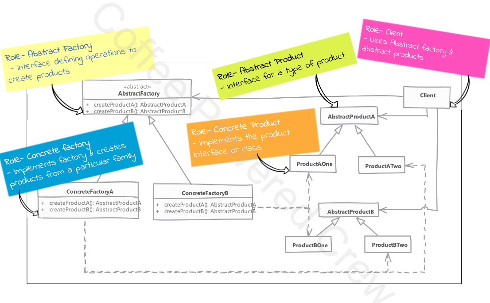

# Abstract Factory

## Type: `Creational`

## What is Abstract Factory?

Abstract Factory is a creational design pattern that lets you produce families of related objects without specifying their concrete classes.

## Where it is used?

* When we have two or more object which work together forming a kit or set and there can be multiple sets of kits which can be created by the client.

* So we separate client code from concrete objects forming such a kit 


## Real world examples in php frameworks or php libraries

* Laravel: Laravel uses the concept of service providers and facades to provide a complete set of objects to the client.


## Implementation considerations

* Factories can be implemented as singletons, we tipically need only one instance of a factory.
* Adding a new product type requires changes in the factory interface and all concrete factories.
* We provide the client code with the concrete factory so that it can create the objects. 

## Implementation steps

* We start by studying the products "sets"
  * Create abstract factory as abstract class or interface
  * Abstract factory defines abstract methods for creating products
  * Provide concrete implementations of the abstract factory for each product set

---

## Compare & Contract with Factory Method

### Abstract Factory
* hides factories as well as concrete objects used from the client code
* suitable when multiple objects are designed to work together & clients must use products from single family at a time
* 
### Factory Method
* hides only the concrete objects from the client code
* concerned with one product & it's variations
* collaboration of product itself with other objects is irrelevant

---

## Pitfalls
* more complex
* adding a new products require changes in the factory interface and all concrete factories
* difficult to visualize the need at start of the development and usually starts as a factory method pattern
* it is very specific to the problem of "product families"

## UML diagram



---

## Documentation of the Example

In this project, the `Client` class uses the `ResourceFactoryInterface` to create cloud instances and storage. This allows the client code to be independent of the specific classes of cloud resources it uses.

By using the Abstract Factory Design Pattern, we can switch between different families of cloud resources (e.g., AWS, Google Cloud) without changing the client code.

### How the Abstract Factory Design Pattern is Implemented
- **Abstract Factory Interface**: The `ResourceFactoryInterface` defines methods for creating cloud instances and storage. This ensures that any class implementing this interface can create these resources.
- **Concrete Factories**: The `AwsResourceFactory` and `GoogleCloudResourceFactory` classes implement the `ResourceFactoryInterface` to create AWS and Google Cloud resources, respectively.
- **Client Code**: The `Client` class uses a `ResourceFactoryInterface` to create and manage cloud resources. It can switch between different factories at runtime to use different cloud providers.

### Benefits
- **Decoupling**: The client code is decoupled from the concrete classes of cloud resources, making it easier to switch between different providers.
- **Scalability**: New families of cloud resources can be added without modifying the client code.
- **Flexibility**: The pattern provides flexibility in configuring the system with different families of objects.

### Example Usage
```php
$resourceFactory = new AwsResourceFactory();

// Here we can change the factory to GoogleCloudResourceFactory at runtime
// and this will change the cloud instance and storage

$resourceFactory = new GoogleCloudResourceFactory();

$client = new Client($resourceFactory);
$instance = $client->createInstance(1024, 512);

$instance->start();
$instance->stop();
