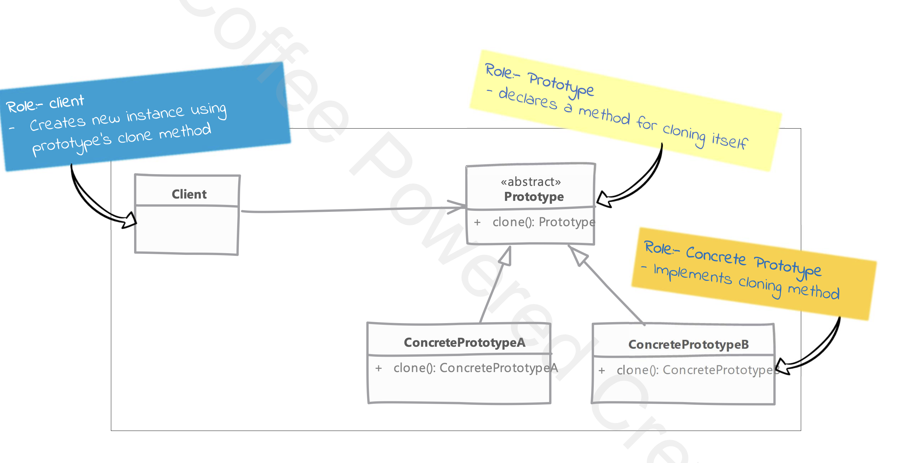

# Prototype

## Type: `Creational`

## What is Prototype?

Prototype is a creational design pattern that lets you copy existing objects without making your code dependent on their classes.

## Where it is used?

* We have a complex object that is expensive to create. To create more instances of the object, we use the existing object as a prototype.

## UML diagram

## Real world examples in php frameworks or php libraries

* `Doctrine` uses the prototype pattern to create new entities by cloning the existing ones.
* `Symfony` uses the prototype pattern to create new objects by cloning the existing ones.
* `Laravel` uses the prototype pattern to create new objects by cloning the existing ones.
* `Guzzle` uses the prototype pattern to create new objects by cloning the existing ones.
* `Monolog` uses the prototype pattern to create new objects by cloning the existing ones.

## Implementation considerations

* pay attention to the deep copy and shallow copy.
  * immutable objects can be cloned using shallow copy.
  * make sure to reset the mutable state of object on cloning.
    * it's a good idea to implement this reset in an abstract method to allow the concrete classes to reset their state specific with their needs.
    
## Implementation steps

* We start by creating a class which will be used as a prototype.
  * The class should implement the `__clone` method.

* Clone method implementation should consider the deep copy or shallow copy based on the requirements.

## Compare and contrast with Singleton

### Prototype
* we return a copy of an instance, meaning we get different instances.
* some or even all of the state of the object can be changed.

### Singleton
* we return the same instance, meaning we get the same instance.
* since it's the same instance that is returned state is always the same.

## Pitfalls

* Usability depends upon the number of properties in state that are immutable or can be shallow copied.
  * An object with a large number of mutable properties can be difficult to clone and not efficient.

* in php default clone method does shallow copy, so we need to implement the deep copy if needed.

---

## Documentation of the Example

### Overview
The Prototype Design Pattern is used to create new objects by copying an existing object, known as the prototype.

This pattern is particularly useful when the cost of creating a new object is more expensive than copying an existing one.
It allows for the creation of new instances without the overhead of initializing a new object from scratch.

### Why Use the Prototype Design Pattern
In this project, the `Request` class simulates a costly operation during its instantiation.

Creating multiple instances of `Request` would repeatedly invoke this costly operation, leading to performance inefficiencies.

By using the Prototype Design Pattern, we can clone an existing `Request` object, bypassing the costly initialization process and improving performance.

### How the Prototype Design Pattern is Implemented
- **Prototype Interface**: The `PrototypeInterface` defines a `__clone` method that all prototype classes must implement. This ensures that any class implementing this interface can be cloned.
- **Client Code**: The `Client` class uses the `HttpClientMock` to send requests. It creates a single `Request` object and clones it multiple times to avoid the costly initialization process.

### Benefits
- **Performance Improvement**: By cloning an existing object, we avoid the costly initialization process, leading to better performance.
- **Simplified Object Creation**: The prototype pattern simplifies the creation of complex objects by reusing existing instances.
- **Flexibility**: It allows for easy creation of new objects with slight modifications without altering the original object.

This implementation demonstrates the effective use of the Prototype Design Pattern to optimize object creation and improve performance in scenarios involving costly operations.
