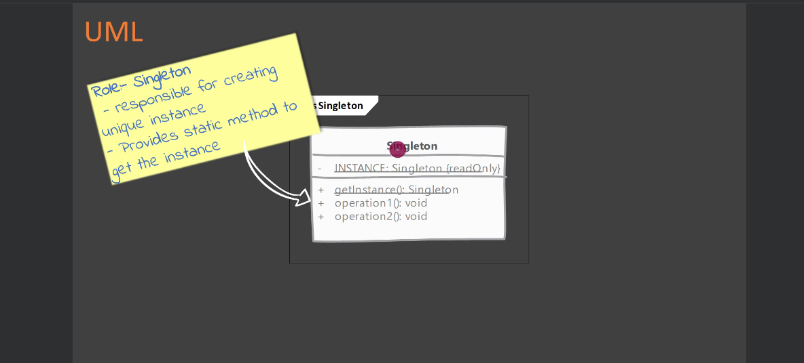

# Singleton

## Type: `Creational`

## What is Singleton?

* Singleton is a creational design pattern that ensures a class has only one instance and provides a global point of access to it.

## Where it is used?

* When we need to ensure that a class has only one instance.

## UML diagram 

## Real world examples in php frameworks or php libraries

* Laravel's `App` class is a singleton class.
* Symfony's `Kernel` class is a singleton class.
* WordPress's `WP` class is a singleton class.
* CodeIgniter's `CI` class is a singleton class.

## Implementation considerations

* Any state you add to the singleton class will be become part of the global state of the application.

* Controlling instance creation
  * Class constructor must not be accessible to clients - it should be private.
  * Subclassing / inheritance must be prevented - it should be final.

* keep track of the instance
  * client itself it's a good place to keep track of the instance.

* giving access to the singleton instance
  * provide a static method to get the instance.

## Design Considerations

* make sure that your singleton class does not carrying a lot of mutable state.

## Compare and contrast with Factory Method

### Singleton
* intent of the singleton is to ensure that a only one instance of a class is ever created.
* is created without any need of arguments from client code.

### Factory Method
* intent of the factory method is to isolate client code from object creation & delegate object creation to factory subclasses.
* factory method requires client code to provide some information to create the object.

## Pitfalls

* any state you add to the singleton class will be become part of the global state of the application.
* they are hard to unit test. You cannot easily mock a singleton class.
* a singleton carrying a lot of mutable state is a good indication of an abused Singleton pattern.

---

## Documentation of the Example

