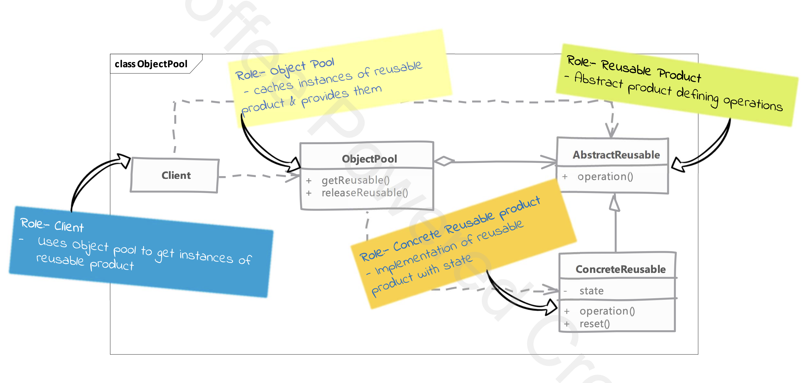

# Object Pool

## Type: `Creational`

## What is Object Pool?

* The Object Pool Design Pattern is a design approach where a pool (or collection) of reusable objects is maintained to avoid the overhead of creating and destroying them repeatedly.

Key Points:
* Pool: A group of pre-created objects that are reused when needed.
* Reuse: Instead of creating a new object every time, one is fetched from the pool.
* Release: Once done, the object is returned to the pool for others to use.
* Efficiency: This saves resources, especially when creating objects is expensive (like database connections).

## Where it is used?

* When the cost of initializing a class instance is high.

## UML diagram 

## Real world examples in php frameworks or php libraries

* Laravel - `Illuminate\Database\Connection`
* Doctrine - `Doctrine\ORM\EntityManager`

## Implementation considerations

* reset object state should NOT be costly operation, otherwise you may end up losing your performance savings.
* pre-caching objects; meaning creating objects before they are requested, can be a good idea as it won't slow down the code using these objects. However, it may add-up start up time & memory usage.

## Design Considerations

* is only beneficial when the cost of creating an object is high. Don't pool objects just to save memory.
* do not pool long lived objects, as they will not be released until the pool is destroyed.
  * in the database connection example, the connection is released back to the pool when the connection is not used by the client e.g. after a query is executed.

## Compare and contrast with Prototype

### Object Pool
* we have cached objects that frequently live through the application's life cycle.
* code using object pool has to return the objects explicitly to the pool.
  * depending on the implementation, failing to return the object to the pool may result in memory leaks.

### Prototype
* create object when needed, and no caching is done.
  * once the objects is cloned no special handling is needed by client code and object can be used like any regular object.

## Pitfalls

* successful implementation depend on correct use of the pool by the client code
  * releasing objects back to the pool can be vital for correct working of the pool.
* the reusable object needs to take care of resetting its state in efficient manner.
  * some objects may not be suitable for pooling if they have a lot of state that needs to be reset.
* difficult to use in refactoring legacy code as both the client code & reusable object both need to be aware of object pool.
* you have to decide what happens when pool is empty and there is a demand for an object
  * the client can either wait for an object to become free, throw exception or create a new object
  * all options have issue - waiting can have severe negative performance impact, throwing exception can be hard to handle, creating new object can defeat the purpose of pooling.
* if you create new object when clients ask for an object and none are available then you have to do additional work to maintain or trim the pool size or else you'll end up with very large pool of objects.

---

