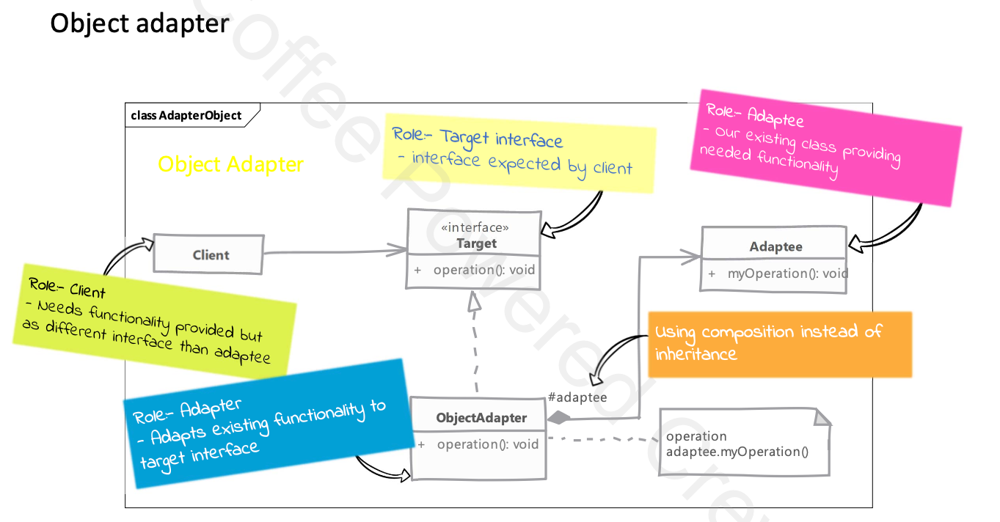

# Adapter

## Type: `Structural`

## What is Adapter?

* We have an existing object which provides the functionality that the client needs.
  * But client code can't use this object directly because it's interface is not compatible with the client code.

## Where it is used?

* When you want to use an existing class, and its interface is not compatible with the client code.

## UML diagram 

## Real world examples in php frameworks or php libraries

* `Illuminate\Database\Connection` in Laravel
  * `Illuminate\Database\MySqlConnection` is an adapter for `Illuminate\Database\Connection` class.
  * `Illuminate\Database\PostgresConnection` is an adapter for `Illuminate\Database\Connection` class.
  * `Illuminate\Database\SQLiteConnection` is an adapter for `Illuminate\Database\Connection` class.
  * `Illuminate\Database\SqlServerConnection` is an adapter for `Illuminate\Database\Connection` class.

## Implementation steps

* we start by creating a class adapter
  * adapter must implement the interface expected by the client code (i.e the target interface)
  * we need to accept the adaptee object (i.e. the object that provides the functionality that the client needs (but does not support)) in the constructor.
    * we will simply forward the calls to the adaptee object.
* an object adapter should take the adaptee object in the constructor instead of instantiating in the constructor.
  * this allows us to use different adaptee objects with the same adapter (remove tight coupling).

## Object Adapter vs Class Adapter

* The concepts of object adapter and class adapter refer to two different ways of implementing the Adapter Design Pattern.

1. Object Adapter (Composition-based Adapter)
* In an object adapter, you use composition to adapt one interface to another.
* The adapter holds a reference to an instance of the class it is adapting and forwards method calls to this instance.
* This approach works with existing objects without requiring multiple inheritance.

Characteristics:
* Composition: The adapter contains an instance of the class it is adapting.
* Flexibility: Since the adapter uses composition, it can adapt many classes, even subclasses, dynamically at runtime.
* Single Inheritance: Works well in languages like PHP, where you can only inherit from one class.
* More common: This approach is more widely used and recommended in PHP due to single inheritance constraints.
 
2. Class Adapter (Inheritance-based Adapter)
   * In a class adapter, the adapter class inherits from both the target interface and the class it is adapting.
   * This allows the adapter to override methods from the adapted class directly and make them compatible with the expected interface.

Characteristics:
* Inheritance: The adapter inherits from both the target interface and the adapted class.
* Less flexible: Since you’re using inheritance, you can only adapt one class, not subclasses or other classes.

## Implementation considerations

* how much work the adapter does depends upon the diffs between the target interface and the adaptee interface.
  * if the target interface is very different from the adaptee interface, the adapter will have to do a lot of work.
  * if the target interface is very similar to the adaptee interface, the adapter will do very little work.

* using object adapter allows you to potentially change the adaptee object to one of further subclasses of the adaptee class.

## Design Considerations

* The Adapter pattern is useful when you want to use an existing class, but its interface is not compatible with the client code.

## Compare and contrast with Decorator

### Adapter vs Decorator
* simply adapts an object to a different interface.
* not easy to use recursive composition (that is an adapter adapting another adapter) because the adapter is adapting the adaptee object, not another adapter.

### Decorator
* enhances an object's behavior without changing its interface.
* since decorator to not change the interface we can do recursive composition or in other words, we can have a decorator that decorates another decorator.

## Pitfalls

* it is tempting to do a lot of things in adapter besides simple interface translation
  * but this can result in an adapter showing different behavior than the adapted object.

---

# Example

The example contains a simple and clear example of how to implement the **Adapter Design Pattern** in PHP. The Adapter Pattern allows two incompatible interfaces to work together by wrapping one class in an adapter that transforms its interface into one that another class can use.

## Scenario

In this example, we simulate a scenario where a third-party payment gateway has a method called `sendPayment()`, but our application expects a method called `processPayment()`. Instead of modifying the third-party class, we create an adapter to bridge the gap between the two interfaces.

## Structure

- `ThirdPartyPaymentGateway`: A third-party class that cannot be modified and has an incompatible interface.
- `PaymentProcessor`: An interface that our application expects for processing payments.
- `PaymentGatewayAdapter`: The adapter that implements the `PaymentProcessor` interface and adapts the third-party class.
- `makePayment()`: A client function that processes payments using any class that implements the `PaymentProcessor` interface.

## How It Works

1. The **ThirdPartyPaymentGateway** class has a method `sendPayment()`.
2. Our application expects an interface called **PaymentProcessor** with a method `processPayment()`.
3. We create an adapter class called **PaymentGatewayAdapter**, which adapts the third-party class by wrapping its `sendPayment()` method and making it compatible with the `processPayment()` method that our application expects.
4. The client code can then use the third-party class indirectly through the adapter.

