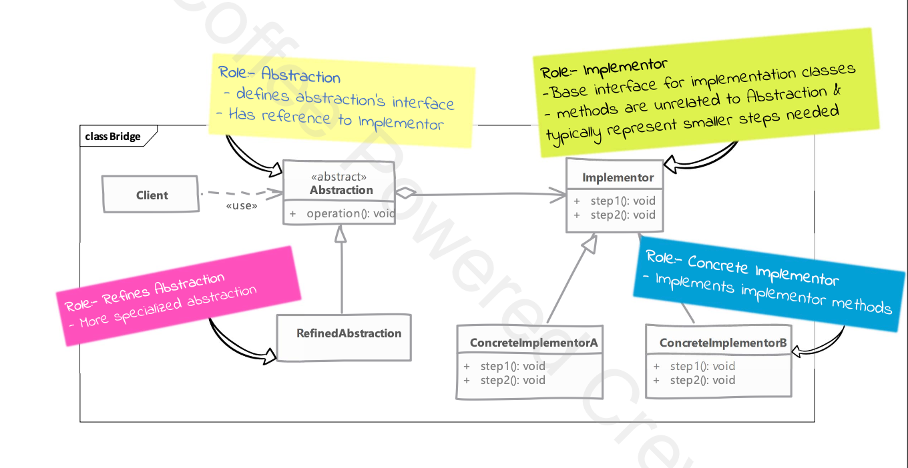

# Bridge

## Type: `Structural`

## What is Bridge?

The Bridge Design Pattern separates an abstraction (what you do) from its implementation (how you do it), so they can evolve independently.

In simple terms, it’s like having two parts of a system that can change separately.

For example, you have different payment types (like one-time or subscription payments) and different payment methods (like PayPal or Stripe).
The Bridge pattern lets you mix and match these easily without changing the core logic.

You “bridge” the abstraction (payment type) with the implementation (payment method) so they can be changed independently.

## Without bridge

Our implementation and abstraction are generally coupled to each other in normal inheritance. If we want to change the implementation, we have to change the abstraction as well.

## With bridge

Using bridge we can decouple the abstraction and implementation and they can vary independently.

We achieve this by creating two separate inheritance hierarchies. One for the abstraction and one for the implementation.

We use composition to bridge these two hierarchies.

## Where it is used?

* When you want to avoid a permanent binding between an abstraction and its implementation.

## UML diagram 

## Real world examples in php frameworks or php libraries

* Laravel's Mailer
* Laravel's Cache

## Implementation steps

* we start by defining our abstraction as needed by the client
  * we determine common base operation and define them in abstraction
  * we can optionally define a refined abstraction to provide more specialized operations
  * then we define our implementor
    * Implementor methods do NOT have to match with abstractor
    * However, abstraction can carry out its work by using implementor methods
  * then we write one or more concrete implementors

## Implementation considerations
* abstraction can decide on its own which concrete implementor to use in its constructor or we can delegate that decision to a third class.
  * in the example we have used our abstraction remains unaware of concrete implementors & provides greater de-coupling

## Design Considerations

* it provides great extensibility by allowing us to change abstraction and implementor independently
* by using abstract factory pattern to create abstraction object with concrete implementation you can decouple concrete implementation from client code

## Compare and contrast with Adapter

### Bridge

* intent is to allow abstraction and implementation to vary independently
* bridge has to be designed up front -> then only we can have varying abstraction and implementation

### Adapter

* is meant to make unrelated classes work together
* adapters finds its usage typically where legacy system is to be integrated with new code

## Pitfalls

* it is fairly complex to understand & implement bridge pattern initially
* you need to have a well thought out & fairly comprehensive design in front of you before you can decide on bridge pattern
* needs to be designed up front. 
  * adding bridge to legacy code is difficult
  * even for ongoing project adding bridge at a later time in development may require fair amount or refactoring

---

# Example

Let's walk through a real-case example of the Bridge Design Pattern in PHP, using a scenario where you have different payment systems (e.g., PayPal, Stripe) and different types of payments (e.g., one-time payments, subscription payments).

The Bridge pattern allows you to decouple these so that the abstraction (the payment types) and implementation (the payment systems) can vary independently.

The Structure:
* Abstraction (Payment Type): Defines the high-level interface for payments (e.g., one-time payment, subscription).
* Implementor (Payment System): Defines the interface for payment systems (e.g., PayPal, Stripe).
* ConcreteImplementor (Specific Payment System): Implements the payment system logic (e.g., PayPal implementation, Stripe implementation).
* Refined Abstraction (Specific Payment Type): Extends the abstraction (e.g., One-time payment or Subscription payment) to use the payment systems.

How the Bridge Pattern is Applied:
* Abstraction (Payment) knows about the Implementor (PaymentSystem) and delegates the work to it.
* ConcreteImplementors (PayPalPaymentSystem, StripePaymentSystem) implement the system-specific logic.
* Refined Abstraction (OneTimePayment, SubscriptionPayment) can change independently of the ConcreteImplementors, allowing you to mix and match different payment systems with different payment types.

Benefits:
* You can easily add more payment systems (e.g., Google Pay) or more payment types (e.g., installment payments) without changing the existing code, which promotes scalability and maintainability.
