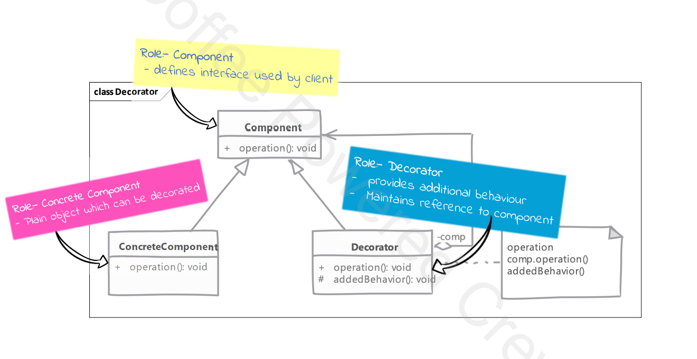

# Decorator

## Type: `Structural`

## What is Decorator?

Decorator is a structural design pattern that lets you attach new behaviors to objects by placing these objects inside special wrapper objects that contain the new behaviors.

A decorator provides alternative to subclassing for extending functionality of existing classes. It is used to add new functionality to an existing object without altering its structure.

## Where it is used?

* when want to enhance behaviour of our existing object dynamically without affecting other objects of the same class

## UML diagram 

## Real world examples in php frameworks or php libraries

* Laravel's middleware
* Symfony's event dispatcher
* WordPress's plugin system

## Implementation steps

* we start with our component
  * components defines interface needed or already used by client
  * concrete component implements the component interface
  * we define our decorator
    * decorator implements the component interface & also need reference to the concrete component
    * in decorator methods we provide additional behaviour on top that provided by concrete component instance

* decorator can be abstract & depend on subclasses to provide functionality

## Implementation considerations

* since we have decorators and concrete classes extending from common component, avoid large state in the base class as decorators may not need all that state
  * the decorators add only their own little things to the behaviour
* pay attention to equals and spl_object_hash of the class. 
  * when using decorator, you have to decide if decorator object is equal to the object without decorator
* decorators support recursive composition
  * a decorator can wrap not only simple components but also another decorator
  * this pattern lends itself to creation of lots of small object that add "just a little bit" of new functionality
  * code using these objects can become hard to read and debug
  

## Design Considerations

* are more flexible & powerful than inheritance
  * inheritance is static by definition but decorators allow you to dynamically compose behaviours using objects at runtime

* decorators should act like additional skin over your object
  * they should add helpful small behaviours to the object original behaviour
  * do not change meaning of operations

## Compare and contrast with Composite

### Decorator

* intent is to "add to" existing behaviour of existing objects
* can be thought as degenerate composite with only one component

### Composite

* meant for object aggregation only
* composites support any number of components in aggregation

## Pitfalls

* often results in large number of classes being added to system, where each class add a small amount of functionality
  * you often end up with lots of objects, one nested inside another, which can be hard to understand and debug

* sometimes new comers will start using it is as a replacement for inheritance in every scenariot
  * they do this because they've heard that composition is favorable over inheritance
  * this is not the intent of the pattern
  * think of decorators a think skin over existing object
  * if you need changes where the behaviour is significantly different, inheritance is better

---

# Example

# Decorator Pattern Example

This example demonstrates the Decorator Pattern in PHP.
The Decorator Pattern allows behavior to be added to individual objects, dynamically, without affecting the behavior of other objects from the same class.

In this example, the Client class uses a transport service that is decorated with both AuthDecorator and RateLimiterDecorator.
The AuthDecorator ensures that the request has a valid token, and the RateLimiterDecorator enforces rate limiting.

The BasicTransporter performs the actual message transport.

## Classes

### `ApiTransportInterface`

An interface that defines the `transport` method which all transport classes must implement.

### `TransportMessage`

A class representing the message to be transported. It contains the message content and authentication token.

### `BasicTransporter`

A class that implements `ApiTransportInterface` and provides basic transport functionality.

### `AuthDecorator`
A decorator class that adds authentication checking to the transport process. It wraps an instance of ApiTransportInterface.

### `RateLimiterDecorator`
A decorator class that adds rate limiting to the transport process. It wraps an instance of ApiTransportInterface.

### `Client`
A class that uses the decorated transport service to send messages.
