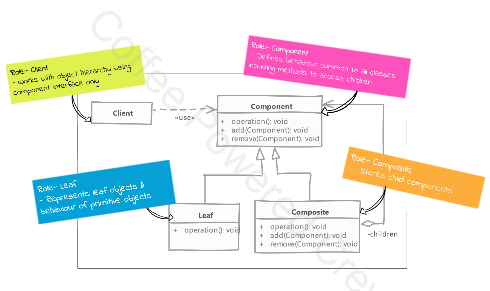

# Composite

## Type: `Structural`

## What is Composite?

Composite lets clients treat individual objects and compositions of objects uniformly.
Composite is a structural design pattern that lets you compose objects into tree structures to represent part-whole hierarchies.

This is not a simple composition concept from OOP but a further enhancement of it.
  * allows you to treat object which has composition and which does not have composition in similar way (i.e. uniformly)

## Where it is used?

* When you have to work with objects that form a part-whole hierarchy

## UML diagram 

## Real world examples in php frameworks or php libraries

* Symfony Form
* Laravel Form
* Symfony Security

## Implementation steps

* we start by creating an abstract class / interface for Component
  * component must declare all methods that are applicable to both leaf and composite
  * we have to choose who defines the children management operation, component or composite
  * we implement the composite
    * an operation invoked on composite is delegated to all its children
  * in leaf node we have to handle the non-applicable operations

* in the end, a composite pattern implementation will allow you to write algorithms without worrying about whether node is leaf or composite

## Implementation considerations

* you can provide a method to access parent of a node
  * this will simply traversal of the entire tree
  * for our example this may be a good idea when the form element are dependent on each other or on the main form
    * e.g. validation of a form element depends on the value of another form element

* you can define the collection field to maintain children in base component instead of composite
  * but again that field has no use in the leaf children
  

## Design Considerations
  * decision need to be made about where child management operations are defined
    * defining them in component provide transparency but leaf nodes are forced to implement those methods which are not applicable to them
    * defining them in composite makes the leaf nodes simpler but the client needs to be made aware of composite

  * overall goal of design should be to make client code easier to implement when using composite
    * this is possible if client code can work with component interface only and doesn't need to worry about leaf-composite direction

## Compare and contrast with Decorator

### Composite

* deals with tree structure of objects
* leaf nodes and composite have same interface and composite simply delegates the operation to its children

### Decorator

* simply contain another (single) object
* decorator add or modify some behaviour of contained object and do not have a notion of children

## Pitfalls

* creating the original hierarchy can be complex implementation if the number of leaf and composite nodes are large

---

## Example

### Problem we are trying to solve
* In a web application, you often need to manage forms with different kinds of inputs.
* Some forms are simple, while others are complex, requiring nested or composite form elements (e.g., a form with text fields, select boxes, and a group of radio buttons).
* You need a structure that allows treating both individual form elements and groups of form elements uniformly.

The Composite pattern lets you compose objects into tree structures to represent part-whole hierarchies.
It allows clients to treat individual objects and compositions of objects uniformly.

#### Classes
* FormElementInterface
  * Interface for form elements. This interface declares the render method that must be implemented by both leaf and composite elements.  
* InputElement
  * Leaf class for Input. Represents a simple input element in a form.  
* ButtonElement
  * Leaf class for Button. Represents a simple button element in a form.  
* SelectElement
  * Leaf class for Select. Represents a select element in a form.  
* Form
  * Composite class. The Form class is the composite that can contain both individual form elements and other composites.  
* Client
  * Client class. Demonstrates the use of the composite pattern by creating and rendering form elements and forms.

#### Benefits:
* Uniformity: The client can treat individual elements and groups of elements (forms and nested forms) uniformly.
* Scalability: You can easily extend this pattern to create more complex form groups or other types of form elements.
* Maintainability: The structure simplifies adding new form elements without modifying existing code.

This pattern could easily extend into more complex scenarios, such as handling validation, grouping form elements (like fieldsets), or creating reusable form structures.
