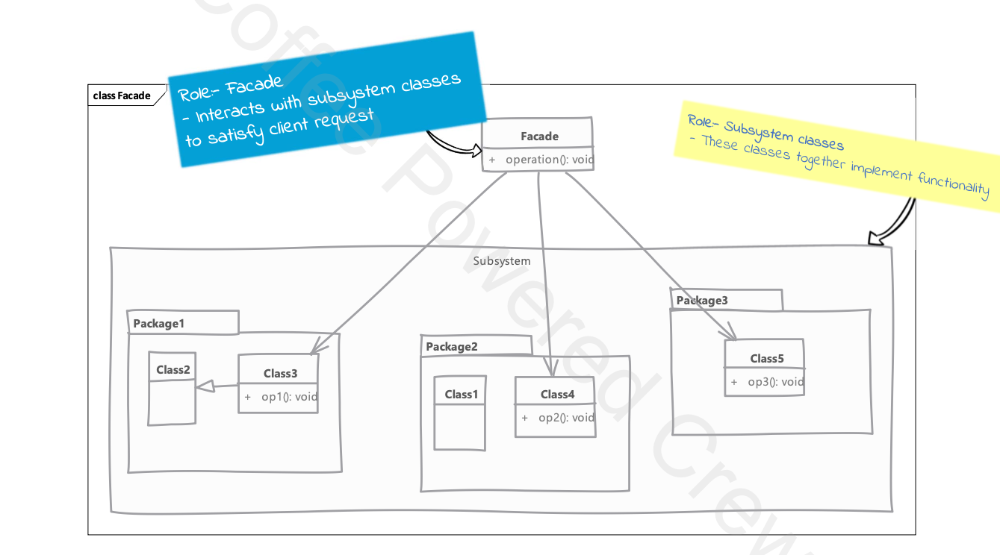

# Facade

## Type: `Structural`

## What is Facade?

Facade is a structural design pattern that provides a simplified interface to a library, a framework, or any other complex set of classes.

* client has to interact with a large number of interface & classes in a subsystem to get a result
  * so client get tightly coupled with the subsystem

* facade provide a simple and unified interface to one or multiple subsystems
  * so client interacts just with the facade and not with the subsystem directly

## Where it is used?

* When you need to provide a simple interface to a complex subsystem.

## UML diagram 

## Real world examples in php frameworks or php libraries

* Laravel's Facades
  * Laravel's facades provide a "static" interface to classes that are available in the application's service container.
  * Laravel's facades are actually the same as service location, the static proxy to access the real service instance behind the scenes.
  * Laravel's facades serve as "static proxies" to underlying classes in the service container, providing the benefit of a terse, expressive syntax while maintaining more testability and flexibility than traditional static methods.
* Symfony's Facades
* Doctrine's Facades

## Implementation steps

* we start by creating a class that will serve as a facade
  * we determine the overall "use case" that the subsystem is used for
  * we write a method that exposes each "use case" or task
  * the methods takes care of working with different classes of the subsystem

## Implementation considerations

* a facade should minimize the complexity of the subsystem and provide usable interface
* a facade is not a replacement for regular usage of classes in subsystem
  * those classes can still be outside of facade
  * your subsystem class implementations should not make assumptions of usage only through facade

## Design Considerations
* great solution for simplifying dependencies

## Compare and contrast with Adapter

### Facade

* intent is to simplify the usage of subsystem for client code
* is not restricted by any existing interface
  * it often defines simple methods which handle complex interactions with subsystem
  
### Adapter

* intent is to simply adapt an object to another interface
* is always written to confirm to a particular interface expected by client code
  * it has to implement all methods from interface and adapt them using existing object

## Pitfalls
* it is often overused or misused & can hide improperly designed API
  * a common misuse is to use them as "containers of related methods"
    * this is not the intent of facade
    * facade should be used to simplify the usage of subsystem

---

## Example

#### Scenario:
You are developing a payment system that processes payments through different gateways and performs additional tasks like validation and fraud checks.
Instead of directly interacting with multiple services, a Facade class provides a simplified interface for processing a payment.

#### Explanation:
* Subsystems: The actual logic for validation, fraud checking, processing, and logging is distributed across individual classes.
* Facade: The PaymentFacade class wraps these subsystems and exposes a single processPayment method to the client.
* Client Interaction: The client doesn’t need to understand the internal complexity. It just interacts with the PaymentFacade, which simplifies the payment process.

This example demonstrates how the Facade design pattern can hide the complexities of multiple subsystems, offering a clean interface for external clients. This pattern is especially useful in large enterprise applications where subsystems tend to grow complex.

#### Subsystems

* PaymentValidator: Validates the payment details.
* FraudChecker: Performs a fraud check on the payment details.
* PaymentGateway: Processes the payment through a gateway.
* TransactionLogger: Logs the transaction details.

#### Benefits of Using the Facade Pattern
* Simplified Interface: The client interacts with just one class (PaymentFacade), instead of multiple subsystems.
* Loose Coupling: The client no longer needs to know the details of the subsystems, making the code easier to maintain.
* Scalability: If additional subsystems (e.g., more complex fraud detection) need to be added, the Facade can incorporate them without changing the client code.
