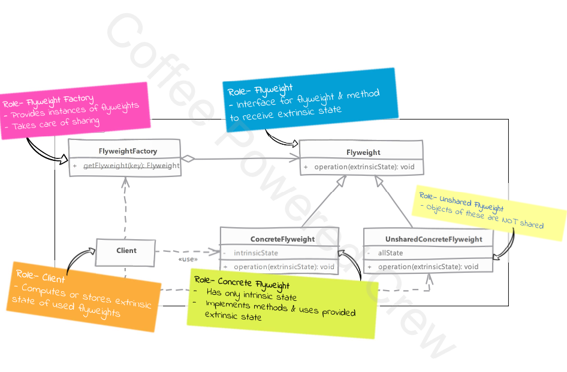

# Flyweight

## Type: `Structural`

## What is Flyweight?

The Flyweight pattern is a design pattern used to reduce memory usage by sharing common parts of objects.

In short, Flyweight helps save memory by sharing objects that have common data and only focusing on the unique parts when necessary.
It's useful when you have a large number of similar objects, like text characters with the same font but different sizes.

### Overview:
* is allowing us to share an object in multiple contexts
  * instead of sharing the entire object, which may not be feasible, we divide the object into two parts
    * the intrinsic state - state that is shared in every context
    * the extrinsic state - state that is unique to each context
  * we crate objects with only intrinsic state and share them in multiple contexts

* client or user of object provides the extrinsic state
  * the flyweight object uses the intrinsic state and the extrinsic state to provide the desired functionality

* we provide a factory so client can get required flyweight object based on some key to identify flyweight object
  * the factory maintains a pool of flyweight objects
  * the factory returns the flyweight object from the pool if it exists
  * if the flyweight object does not exist, the factory creates a new flyweight object and adds it to the pool

## Where it is used?

* our system needs a large number of objects of a particular class & maintaining these instances is a performance concern.

## UML diagram 

## Real world examples in php frameworks or php libraries

* Laravel uses Flyweight pattern in its `View` class to render views. The `View` class is a shared object that is used to render different views with different data.
* Symfony uses Flyweight pattern in its `Form` component to render forms. The `Form` class is a shared object that is used to render different forms with different data.

## Implementation steps
* we start by identifying the intrinsic and extrinsic state of the object
  * we create an interface for flyweight to provide common methods that accept extrinsic state
  * in implementation of shared flyweight object, we add the intrinsic state & also implement the methods

* in unshared flyweight object, we simpy ignore the extrinsic state as we have all state within the object

* next we implement the factory which caches the flyweight objects & provide methods to get them

* in our client we either maintain the extrinsic state or compute it on the fly when using the flyweight object

## Implementation considerations

* a factory is necessary with flyweight pattern as client code need easy way to get hold of shared flyweight objects
  * also the number of shared object can be large so a central place is a good strategy to keep track of all of them

* flyweight intrinsic objects should be immutable

## Design Considerations

* usability of flyweight is entirely dependent upon presence of sensible extrinsic state in object which can be moved out of object without any issues

## Compare and contrast with Object Pool

### Flyweight

* state of flyweight is divided
  * client must provide part of state to ti
* in a typical usage client will not change the intrinsic state of flyweight object as it is shared

### Object Pool

* a pool object contains all of its state encapsulated within itself
* clients can and will change state of pool objects

## Pitfalls

* runtime cost may be added for maintaining the extrinsic state
  * client code has to either maintain it or compute it every time it needs to use flyweight

* it is often difficult to find perfect candidate objects for flyweight pattern
  * graphical apps benefit heavily from flyweight pattern as they have many objects with shared state
  * a typical web application may not have a lot of use for this pattern

---

## Example

#### Problem

* Imagine you are building a document editor where each character on the screen has its own style (font, size, color). Rather than creating a unique object for every single character (which could be thousands or millions), you could apply the Flyweight pattern to share common styles between characters
* In a document, there could be thousands of instances of the letter "A", but they may share the same font, color, and size. The Flyweight pattern helps by sharing a single instance of "A" with the same formatting instead of duplicating that object many times.

####  Implementation Details
* Intrinsic State: This is the shared state that remains constant across different contexts. In our example, this includes the font, size, and color of the text.
* Extrinsic State: This is the state that varies with each context. In our example, this could be additional decorations like bold or italic.
* Flyweight Factory: This factory is responsible for creating and managing the pool of shared objects. It returns an existing object from the pool if it exists, or creates a new one if it does not.
* Client: The client (in this case, the Document class) uses the flyweight objects and provides the extrinsic state when necessary.
####  Benefits
* Memory Efficiency: By sharing common parts of objects, the Flyweight pattern significantly reduces memory usage.
* Performance Improvement: Reducing the number of objects created can lead to performance improvements, especially in memory-constrained environments.

#### Use Cases
* Text Editors: Managing character formatting in large documents.
* Graphics Systems: Reusing graphical objects like shapes or icons.
* Game Development: Managing large numbers of similar game objects, such as trees in a forest.
