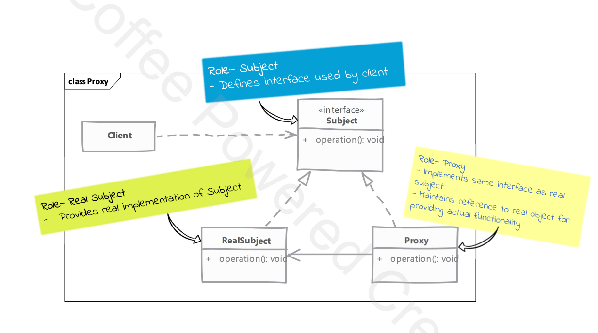

# Proxy

## Type: `Structural`

## What is Proxy?

Proxy is a structural design pattern that provides a surrogate or placeholder for another object to control access to it.

Client is unaware of the proxy existence of proxy

* Proxy perform work transparently

There are 2 ways to implement proxy:
* static proxy - proxy is created at compile time
  * we create a proxy class that implements the same interface as the real object
* dynamic proxy - proxy is created at runtime
  * we use a language feature or feature to create a proxy object at runtime

1. When Static Behavior is Desired:
   * Static proxies are best used when the behavior you want to implement does not need to be dynamically adjusted at runtime.
   * If the additional logic is fixed (like security checks, logging, or caching) and you know which methods will require proxy behavior in advance, a static proxy is often simpler and more predictable.
     * Example: You always want to log every call to a certain service (like payment processing). Since this logic will never change dynamically, a static proxy ensures consistent logging without runtime overhead.

2. When Dynamic Behavior is Desired:
   * Dynamic proxies are best used when you need to adjust the behavior of the proxy at runtime.
   * If the additional logic is generic and can be applied to multiple objects or methods, a dynamic proxy can be more flexible and reusable.
     * Example: You want to measure the execution time of different methods in your application. Instead of creating a separate static proxy for each method, you can use a dynamic proxy to measure the execution time of any method at runtime.

  
## Where it is used?

It is used mainly for:
* protection-proxy - Control access to the real object
* remote-proxy - Provide a local representation for an object that is in a different address space
* virtual-proxy - delay construction of the real object until it is needed

## UML diagram 

## Real world examples in php frameworks or php libraries

* Laravel - Proxy Pattern is used in Laravel for lazy loading of relationships. When you define a relationship in a model, it is not loaded until you access it.
* Doctrine - Doctrine uses Proxy Pattern to create proxy objects for lazy loading of entities.
* Testing - Proxy Pattern is used in testing frameworks to create mock objects.

## Implementation steps

* we start by implementing our proxy
  * proxy must implement the same interface as the real object
  * we can either create the real object later when required os ask for one in the constructor
  * in method implementation of proxy we implement proxy functionality before delegating to the real object

* how to provide client with proxies instances is decided by the application
  * we can provide a factory
  * or compose client code with proxy instances

## Implementation considerations

* how proxy gets hold of the real object depends on what purpose the proxy serves
  * if the real object is expensive to create, we postpone its creation until it is needed
    * e.g. in cases where the real object is a large file or a network connection
      * we may not use the real object at all

* proxy itself can maintain/cache some state on behalf of real object on demand use cases

* pay attention to performance cost of proxies as well as synchronization issues added by proxies

## Design Considerations

* proxies typically do not need to know about the actual concrete implementation of the real object
  * they can work with the real object through an interface
  * this allows us to change the real object without changing the proxy

* using php we can create dynamic proxies using the `__call` magic method
  * this allows us to intercept calls to methods that do not exist in the proxy
  * we can then decide what to do with the call

* proxies are great for implementing security or as stand-ins for real object which may be a costly object that you want to defer loading

## Compare and contrast with Decorator

### Proxy

* depending on type of the proxy it doesn't need real object all the time
* purpose of proxy is to provide feature like access control, lazy loading, auditing, etc.
  * this functionality is not used by the client directly

### Decorator

* a decorator always needs a real object to decorate
* a decorator adds behavior to the real object & that behaviour is used by the client

## Pitfalls

* adding a proxy can introduce a performance overhead
  * especially if the proxy is used to cache results or perform additional operations

* if you need proxies for handling multiple responsibilities on the same instance (like auditing, logging, authentication, etc), is better to have a singe proxy to handle all these requirements
  * due to the way some proxies create object on their own, having multiple proxies can lead to multiple instances of the real object being created
    * this can lead to unexpected behavior and can be avoided by having a single proxy that handles all the responsibilities

* static proxies look quite similar to other patterns like decorator & adapter
  * it can be difficult to figure out from code alone for someone not familiar with the codebase

---

## Example

### Static Proxy

#### Problem

Let’s consider a Database Query Proxy in an enterprise application. 
In large applications, querying a database for each request could be slow and expensive.
We can use a proxy to cache results and only hit the database when necessary.

#### Explanation:
* RealDatabase: Represents the actual database interaction. It fetches data by executing a query.
* DatabaseProxy: Acts as a "stand-in" for the real database. Before hitting the database, it checks if the result of a query is already cached. If so, it returns the cached result, avoiding the need for another database hit.

#### Few other conceptual examples:

1. Remote Proxy (API Requests)
   * A Remote Proxy is useful when dealing with services that are far away or expensive to connect to, such as a remote API. Instead of hitting the API directly, the proxy can manage retries, timeouts, or even cache the API responses.
   * Example: API Request Proxy
     * Imagine a scenario where you're interacting with a third-party payment gateway API, but you don't want to make a request for every single call. You can create a proxy that handles retries or caching.

2. Protection Proxy (Access Control)
   * A Protection Proxy controls access to a real object by adding permission checks. It’s useful when you want to ensure that only authorized users can access certain resources or perform certain actions.
   * Example: User Access Control
     * Imagine a system where only administrators can perform certain actions like deleting users. The proxy ensures that only users with admin rights can execute this operation.

3. Smart Proxy (Resource Management)
   * A Smart Proxy adds additional behavior to manage the lifecycle of a resource. For example, it can control object access by locking resources, counting references, or logging.
   * Example: Logging Proxy
     * You can create a logging proxy that records each time a resource is accessed. This is useful in auditing systems or applications that require tracking of object usage.
     
4. Virtual Proxy (Lazy Loading)
   * A Virtual Proxy is used when the real object is expensive to create. It postpones object creation until it’s needed. For example, loading large files or media like images or documents.
   * Example: Lazy Loading of Large Files
     * Imagine you have a document management system. Some documents are huge and should only be loaded into memory when absolutely necessary. The proxy helps you "delay" the loading until a specific method is called
     * maybe that document will not be needed at all - this is the reason why we postpone the loading

---

### Dynamic Proxy

## Dynamic Proxy Example Documentation

### Overview

This example demonstrates the use of a dynamic proxy to benchmark the execution time of methods in two service classes (`Service1` and `Service2`).

The dynamic proxy, implemented in the `BenchmarkProxy` class, wraps the real service objects and intercepts method calls to measure and log their execution time.

### Components

1. **Service Classes**:
  - `Service1`: Contains methods `method1`, `method2`, and `method3` that simulate processing by sleeping for a short duration.
  - `Service2`: Similar to `Service1`, it contains methods `method1`, `method2`, and `method3` with simulated processing.

2. **Benchmark Proxy**:
  - `BenchmarkProxy`: A dynamic proxy class that intercepts method calls to the real service objects. It measures the execution time of each method call and logs the results.

3. **Client**:
  - `Client`: A class that demonstrates the usage of the `BenchmarkProxy` with `Service1` and `Service2`. It has two methods:
    - `withProxy()`: Uses the `BenchmarkProxy` to wrap the service objects and benchmark their method calls.
    - `withoutProxy()`: Calls the methods directly on the real service objects without benchmarking.

### Usage

1. **Initialization**:
  - The `Client` class initializes instances of `Service1` and `Service2`.

2. **Benchmarking with Proxy**:
  - The `withProxy()` method in the `Client` class demonstrates how to use the `BenchmarkProxy` to wrap the service objects. It benchmarks the execution time of the methods and logs the results.

3. **Direct Method Calls**:
  - The `withoutProxy()` method in the `Client` class shows how to call the methods directly on the real service objects without using the proxy. This method does not perform any benchmarking.

### Execution

- The script initializes a `Client` object and calls both `withProxy()` and `withoutProxy()` methods to demonstrate the difference in execution with and without the dynamic proxy.

### Conclusion

This example illustrates how a dynamic proxy can be used to add additional behavior (benchmarking in this case) to method calls of existing classes without modifying their code. This pattern is useful for cross-cutting concerns like logging, security, and performance monitoring.
