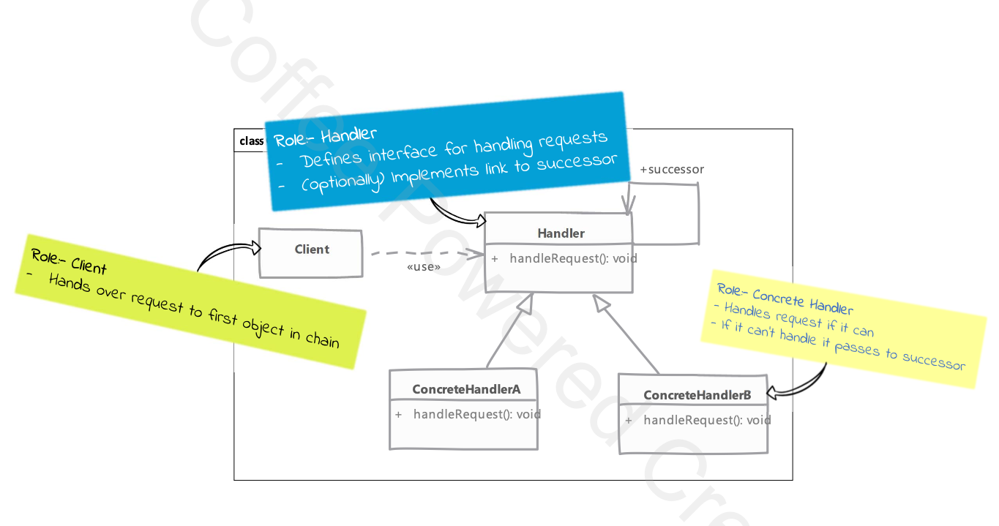

# Chain of Responsibility

## Type: `Behavioral`

## What is Chain of Responsibility?

* The Chain of Responsibility pattern is a behavioral design pattern that lets you pass requests along a chain of handlers.
  * Each handler decides either to process the request or to pass it to the next handler in the chain.
   
* !! The key idea is that you can decouple the sender of a request from the logic that processes it. !!

## Where it is used?

* When you can process a request in multiple ways, but you don't know which handler is going to process the request.
* When you want to issue a request to one of several objects without specifying the receiver explicitly.

e.g.
* Applying a discount to a sale. The discount can be applied in multiple ways, but you don't know which discount will be applied.
* Applying email filters. An email can be filtered in multiple ways, but you don't know which filter will be applied.

## UML diagram 

## Real world examples in php frameworks or php libraries

* Laravel Middleware
* Symfony EventDispatcher
* PSR-15 Middleware
* PSR-7 Middleware
* Filter chain in Zend Framework

## Implementation steps

* we start by defining handler interface / abstract class
  * handler must define method to accept incoming request
  * handler can define method to access successor in chain

* next we implement handle in one or more concrete handlers
  * concrete handler should check if it can handle the request
    * if not, it should pass the request to the next handler in the chain

* we have to create our chain of handlers next
  * we can do it in the client
  * typically, in real world, this job will be done by some framework or initialization code written by us

* client needs to know only the first object in chain
  * it will pass the request to the first object

## Implementation considerations
  * prefer defining handler as interface
  * handlers can allow the request to propagate even if they can handle it
    * e.g. cases like logging, auditing, applying multiple discounts etc.
  * chain can be describer using xml or json as well so that you can add or remove handlers from chain without changing the code

## Design Considerations

* question of who should be responsible for creating the chain
  * client can create the chain
  * chain can be created by some framework or initialization code
  * chain can be created by some factory
  
## Compare and contrast with Command pattern

### Chain of Responsibility

* if handler can't handle the request, it passes the request to the next handler in the chain
* there is no guarantee that the request will be handled by at least one handler
* we don't track which handler handled the request
  * we can't reverse the action of a handler

### Command

* there is no passing it on of the request
  * command handles request by itself
* it is assured that command will be executed and request will be handled
* commands are trackable 
  * we can store command instances in same order as they execute, and they are reversible in nature

## Pitfalls

* there is no guarantee the request will be handled
  * but this can be a feature as well

* it is easy to miss configure the chain when we are connecting successors
  * there is nothing in the pattern that will let us know of any such problems
    * some handlers may be left unconnected to the chain
* it can be difficult to debug the chain
  * we can't easily see the chain of handlers
  * we can't easily see the order of handlers in the chain 

---

## Example

#### Problem 1 - Applying a discount to a sale

##### Overview
* In this example, we demonstrate how the Chain of Responsibility pattern can be used to apply various discounts to a sale. 
* The pattern allows us to pass the order through a chain of discount handlers, each of which can apply a specific type of discount or pass the order to the next handler in the chain.  

We need to apply different types of discounts to an order, such as standard discounts, seasonal discounts, and loyalty discounts. The order of applying these discounts is important, and we want to ensure that each discount is applied only if certain conditions are met.  

##### Solution
* Define Discount Handlers: Create different discount handlers for each type of discount. Each handler will implement a common interface and will have the ability to pass the order to the next handler in the chain if it cannot apply the discount.  
* Chain the Handlers: Instantiate the discount handlers and chain them together. The first handler in the chain will be responsible for starting the discount application process.  
* Process the Order: Pass the order to the first handler in the chain. Each handler will either apply its discount or pass the order to the next handler.  

##### Benefits
* Decoupling: The sender of the request (the client) is decoupled from the logic that processes the request (the discount handlers).
* Flexibility: New discount handlers can be added or existing ones can be modified without changing the client code.
* Responsibility: Each handler has a single responsibility, making the code easier to maintain and understand.

---
#### Problem 2 - Applying email filters

##### Overview

* In this example, we demonstrate how the Chain of Responsibility pattern can be used to filter spam emails.
* The pattern allows us to pass an email through a chain of filter handlers, each of which can apply a specific type of filter or pass the email to the next handler in the chain.  

We need to filter emails based on various criteria such as spam sources, spam keywords, and attachments. The order of applying these filters is important, and we want to ensure that each filter is applied only if certain conditions are met.  

##### Solution
* Define Filter Handlers: Create different filter handlers for each type of filter. Each handler will implement a common interface and will have the ability to pass the email to the next handler in the chain if it cannot filter the email.
* Chain the Handlers: Instantiate the filter handlers and chain them together. The first handler in the chain will be responsible for starting the filtering process.
* Process the Email: Pass the email to the first handler in the chain. Each handler will either apply its filter or pass the email to the next handler.

##### Benefits
* Decoupling: The sender of the request (the client) is decoupled from the logic that processes the request (the filter handlers).
* Flexibility: New filter handlers can be added or existing ones can be modified without changing the client code.
* Responsibility: Each handler has a single responsibility, making the code easier to maintain and understand.
