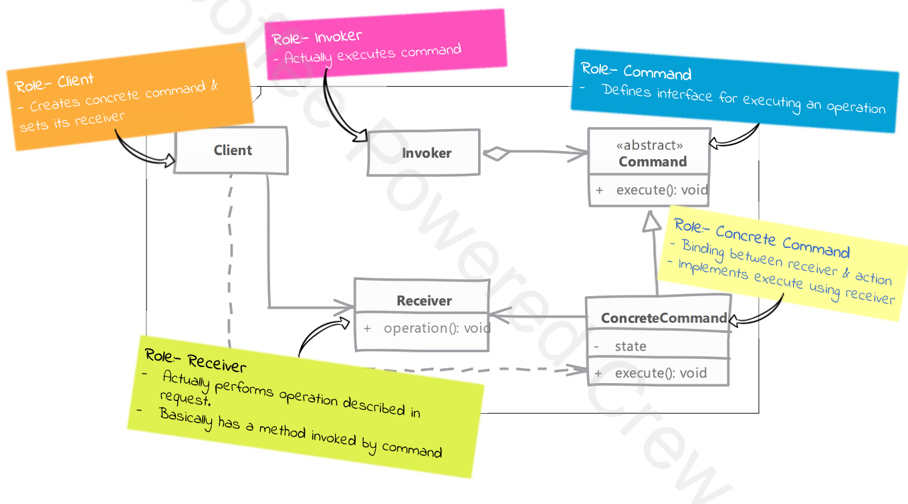

# Command Pattern

## Type: `Behavioral`

## What is Command Pattern?

* we want to represent a request or a method call using an object
  * information about parameters passed and actual operation is encapsulated in an object called command

* advantage is that, what would have been a method call is now an object which can be stored for later execution or sent to other parts of the code

* we can now even queue our command object and execute them later

## Where it is used?

* When you want to parameterize objects with operations
* When you want to queue operations, schedule their execution, or send them across the network

## UML diagram 

## Real world examples in php frameworks or php libraries

* Laravel Artisan commands
* Symfony Console commands

## Implementation steps

* we start by writing command interface
  * it should be simple and just define method which execute the command

* we next implement this interface in concrete command classes
  * each concrete command class will have a reference to the receiver object
  
  * command should also allow for undo operations if your system requires it

* each command knows exactly which method of receiver object to call
  * all it's needs is parameters for the operation to be executed (e.g. arguments to a method etc.)

* clients create the commands instance 
  * the receives can be passed to the command, or it will be created by the command itself at the time of execution (i.e. when the command is executed by runner)

## Implementation considerations

* we can support undo & redo functionality by adding undo method to the command interface

* for commands that are going to be queued for long durations, pay attention to size of state maintained by the command
  * if the state is large, it might be better to store the state in a separate object and pass it to the command  

  
## Design Considerations

* commands can be inherited from other commands to reuse portions of code and build open the base

* you can also compose command with other commands as well (composition)
  * these macro commands will have one or more sub-commands executed in sequence to complete the request

* for implementing undo feature in your command you can make use of memento design pattern, which allows command to store the state information of receiver without knowing about internal objects used by receiver.

  
## Compare and contrast with Strategy Pattern

### Command

* contains which operation is to be executed by the receiver
  * the command knows what operation to do, but not how to do it - it will delegate the operation to the receiver

* command encapsulate an action

### Strategy

* contains how the operation is to be carried out 
  * the strategy knows how to do the operation, but not what operation to do

* strategy encapsulate a particular algorithm

## Pitfalls

* things get a bit controversial when it comes to returning values & errors handling with command

* error handling is difficult to implement without coupling back the command with the client
  * but this defeats the purpose of command pattern which is to decouple the client from the receiver

* in cases where invoker is running as a different process, which is very common situation where command is useful, error handling becomes even more difficult
  * there are strategies to handle this (e.g. observer pattern, event dispatcher etc.), but they are not as clean as the command pattern itself 
  
---

## Example

#### Problem Overview

* In the provided example, the Command Design Pattern is used to manage and execute a series of employee-related operations in a decoupled and flexible manner.
* The main problem being addressed is the need to handle various tasks such as creating an employee, sending a welcome email, and assigning a trainer in a way that allows for easy addition of new tasks, scheduling, and potential undo functionality.

#### Specific Problems Solved:

* Decoupling Task Execution: By encapsulating each task (e.g., creating an employee, sending an email) into its own command object, the system decouples the task execution from the task initiation. This makes the system more modular and easier to maintain.
* Task Scheduling and Queuing: Commands can be stored in a repository and executed later, allowing for flexible scheduling and queuing of tasks.
* Extensibility: New tasks can be added without modifying existing code, simply by creating new command classes and corresponding factories.
* Undo Functionality: Commands can be stored and potentially undone if needed, providing a way to reverse operations if required.

#### Example Structure
In the provided example, the Command Design Pattern is used to manage employee-related operations such as creating an employee, sending a welcome email, and assigning a trainer.
The process is typically run as a background process or a cron job.

* Command Interface: Defines the execute method that all concrete commands must implement.

* Concrete Commands:
  * CreateEmployeeCommand: Handles the creation of a new employee.
  * SendWelcomeEmailCommand: Sends a welcome email to the new employee.
  * AssignTrainerCommand: Assigns a trainer to the new employee.
* Factories: Used to create instances of the concrete commands.
  * AbstractCommandFactory: Abstract factory for creating commands.
  * CreateEmployeeCommandFactory, SendWelcomeEmailCommandFactory, AssignTrainerCommandFactory: Concrete factories for creating specific commands.
* Services: Perform the actual operations.
  * CreateEmployeeService: Service for creating employees.
  * EmailService: Service for sending emails.
  * AssignTrainerService: Service for assigning trainers.
* Command Repository: Stores and retrieves commands to be executed.
* Command Runner: Executes the commands retrieved from the repository.

#### Workflow
* Command Execution: The CommandRunner retrieves commands from the repository and executes them.
