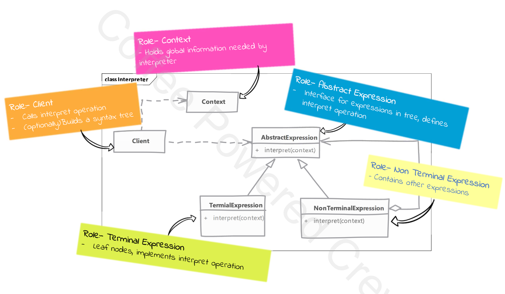

# Interpreter

## Type: `Behavioral`

## What is Interpreter?

The Interpreter design pattern is used to define a grammar for a language and provide an interpreter that interprets sentences in the language.

It’s commonly used when you have a recurring problem that can be represented by a language or expressions (like parsing and evaluating sentences).

This pattern is useful when you need to evaluate expressions repeatedly in different contexts.


## Where it is used?

When we want to process simple "languages" with rules or grammar

Allows us to represent the rules of grammar in a data structure and then interpret that data structure

Each class in this pattern represents a rule in the grammar.
    * Classes also provide a method to interpret an expression.

## UML diagram 



## Real world examples in php frameworks or php libraries

- Symfony Expression Language
- Doctrine Query Language

## Implementation steps

* we start by studying rules of the language for which we want to build interpreter
  * we define an abstract class or interface to represent the expression & define a method in it which interprets the expression
  * each rule in the class become an expression
    * expression which don't need other expression to interpret are called terminal expressions
  * we then create non-terminal expression classes which contain other expressions.
    * this will in turn call interpret on children as well as perform interpretation of their own


* building the abstract syntax tree (i.e. rules tree) can be done by client itself, or we can create a separate class to do that (i.e. ExpressionBuilder)
  * this class will take the input string and parse it to create the tree
  * this class will also have a method to interpret the tree

* the client will the use this tree to interpret the initial expression (i.e.s sentence)

* a context is passed to the interpreter
* the context contains the data that the interpreter will use to interpret the expression


## Implementation considerations

* you still have to do the parsing
  * this pattern doesn't talk about how to actually parse the language & build the abstract syntax tree

* context object can be used to store & access state of the interpreter
  * this can be useful when you want to store the state of the interpreter between different calls to interpret
    * one rule along the execution may use the result of another rule e.g. in a calculator, the result of one operation may be used in another operation


## Design Considerations

* you can use flyweight pattern for terminal expressions
  * you'll often find that terminal expression can be reused

  
## Compare and contrast with Visitor

### Interpreter

* represents language rules or grammar as object structure
* has access to properties is need (i.e. context) for doing interpretation

### Visitor

* represents operations to be performed on object structure
* we need an observable and observer functionality to gain access to the properties


## Pitfalls

* class per rule can quickly result in large number of classes, even for moderately complex grammar
  * this can make the code difficult to maintain
  * but this may also be a good thing as it makes the code more modular
    * you can easily add new rules or modify existing ones without affecting other rules

* not suitable for domains with complex grammar rules

* the building of the abstract syntax tree can be complex and recursive
  * you may need to use other patterns to help with this
    * e.g. Composite pattern to build the tree

* the pattern is very specific to the problem of interpreting languages

---

## Example


#### Problem Overview

We need to evaluate complex validation rules for user data in different contexts. 
The rules can be combined using logical operators like AND, OR, and NOT.
The Interpreter design pattern helps us define a grammar for these rules and provides an interpreter to evaluate them.  

#### How the Pattern is Used

1. **Defining the Grammar**: The grammar for the validation rules is defined using classes that implement the `ValidationRuleInterface`. Each class represents a specific rule or a combination of rules.
2. **Building the Abstract Syntax Tree (AST)**: The `ExpressionBuilder` class takes a configuration array that defines the rules and their combinations. It parses this array and constructs the AST, which is a tree of rule objects.
3. **Evaluating the Expressions**: The AST is used to evaluate the validation rules against a given context. 
   * The context is an associative array that contains the data to be validated.
   * The root of the AST is a non-terminal expression that combines other rules.
   * It evaluates its child rules and combines their results to produce the final result.


#### Components

* ValidationRuleInterface: Defines the interface for all validation rules.
* AbstractValidationRule: An abstract class that implements common functionality for validation rules.
* Terminal Expressions: Concrete classes that represent the simplest rules.
* Non-Terminal Expressions: Concrete classes that represent logical combinations of rules.
* ExpressionBuilder: A class that builds the abstract syntax tree (AST) from a configuration array.
* ValidationRuleInterface: Defines the method that all validation rules must implement

#### Concrete Examples

1. **Age Validation**: A terminal expression that checks if the user's age is greater than a specified value. For example, `AgeGreaterThanRule` with a minimum age of 18.
2. **Country Validation**: A terminal expression that checks if the user's country code matches a specified value. For example, `CountryIsRule` with a country code of 'RO'.
3. **Email Validation**: A terminal expression that checks if the user's email is valid. For example, `EmailValidRule`.
4. **Admin Check**: A terminal expression that checks if the user has an admin role. For example, `IsAdminRule`.

#### Example Configuration

The configuration array defines the rules and their combinations. For example:

```php
$config = [
    'and' => [
        [
            'rule' => AgeGreaterThanRule::class,
            'ruleConfig' => [
                'minAge' => 18,
            ],
        ],
        'not' => [
            'and' => [
                [
                    'rule' => CountryIsRule::class,
                    'ruleConfig' => [
                        'countryCode' => 'RO',
                    ],
                ],
                [
                    'rule' => IsAdminRule::class,
                    'ruleConfig' => [],
                ],
            ],
        ],
    ],
];
```

### Evaluating the Expressions
* Building the AST: The ExpressionBuilder parses the configuration array and constructs the AST.
* Executing the Rules: The root of the AST is a non-terminal expression that combines other rules. It evaluates its child rules and combines their results.
* Context: The context is an associative array that contains the data to be validated. For example:

```php
$context = [
    'age' => 22,
    'countryCode' => 'RO',
    'email' => 'cristi.bitoi@gmail.com',
    'userRole' => 'admin',
];
```

#### Final Evaluation
The root of the AST evaluates the context and produces the final result. For example, the AndRule at the root will evaluate its child rules and combine their results using the logical AND operator.

#### Conclusion
* This example demonstrates how the Interpreter design pattern can be used to evaluate complex validation rules in different contexts. 
* The ExpressionBuilder class simplifies the creation of the abstract syntax tree (AST) from a configuration array, making it easier to manage and extend the rules.
