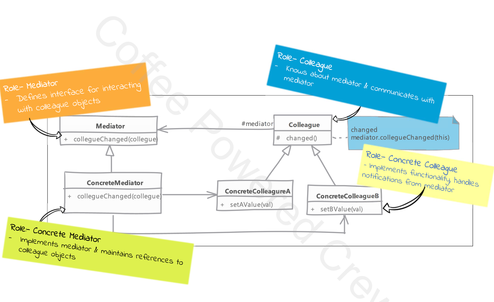

# Mediator

## Type: `Behavioral`

## What is Mediator?

The Mediator design pattern is used to reduce the complexity of communication between multiple objects in a system.

Instead of each object communicating directly with others (which can lead to a tangled web of dependencies), they communicate through a mediator.

The mediator handles all the communication, allowing the objects to be more loosely coupled and focused on their own logic.

The Mediator design pattern is used to reduce the complexity of communication between multiple objects in a system. 

Instead of each object communicating directly with others (which can lead to a tangled web of dependencies), they communicate through a mediator.

The mediator handles all the communication, allowing the objects to be more loosely coupled and focused on their own logic.

* Benefits of this arrangements is that the interaction can now change without needing modifications to participating objects.
  * changing mediator allows to add / remove participants in interactions

### Simple Example:

Imagine a chat room where users can send messages to each other.
Instead of users sending messages directly, they go through the chat room (the mediator).
The chat room handles delivering the message to the appropriate users.

### Key Concepts:

* Mediator: The central authority that manages interactions between objects.
* Colleague objects: The objects that interact with each other through the mediator.

## Where it is used?

* When a system has many objects that need to communicate with each other.
* When the interactions between objects are complex and need to be managed centrally.
* When the interactions between objects need to be decoupled.
* When adding new objects or changing interactions should not require modifying existing objects.

## UML diagram 

## Real world examples in php frameworks or php libraries

* Laravel - Event Dispatcher
* Symfony - Event Dispatcher
* WordPress - WP_Hook
* Magento - Event Manager
  
## Implementation steps

* we start by defining mediator
  * mediator define a generic method which is called by other objects. (e.g. notify)
  * the method typically needs to know which object changed and optionally extract property which has changed in that object
  * we implement this method in which we notify the rest of the objects (if required) about the state change

* mediator needs to know about all participants in the collaboration in its mediating.
    * to solve this we can either have object register with mediator or mediator can be injected into the object.

* depending upon your particular implementation you may need to handle the infinite loop of change-notify-change which can result if one object changes the state of another object which in turn notifies the mediator which in turn notifies the first object, and so on.

## Implementation considerations

* it's important that mediator can identify which object has sent change notification
  * this can be done by passing the object itself or some unique identifier
  * this is important because mediator needs to know which object has changed and what has changed in that object for it to take appropriate action to notify other objects

* if an object took a very long time to process the change it can affect overall performance of the mediator severely
  * in fact this is common in any notification system
  * to solve this we can use a queue system where the mediator queues the notifications and processes them in a separate thread

* we often end up with complex mediator since it becomes a central point wgucg ends up handling all routing between objects
  * this can make it  very difficult to maintain the mediator as the complexity grows
  * this can be solved by using observer pattern in conjunction with mediator pattern
    * mediator can be used to coordinate the communication between observers and observers can be used to communicate with mediator

## Design Considerations

* we can use observer design pattern to implement the notification mechanism through which object notify the mediator
  

## Compare and contrast with Observer pattern

### Mediator

* intent is to encapsulate complex interaction between objects
* mediator implementations are typically specific to objects being mediated

### Observer

* intent is to define one-to-many relationship between objects
* observer pattern implementations are generic.
  * once implemented it can be used with any classes

## Pitfalls

* Mediator can become a central point of failure
  * if mediator fails, the entire system can fail
  * this can be mitigated by having multiple mediators or having a backup mediator

* Mediator can become quite complex
  * as the number of objects increases, the mediator can become more complex
  * this can be mitigated by using observer pattern in conjunction with mediator pattern

---

## Example

### Overview

In this example, the Mediator pattern is used to manage the interactions between different components of an order processing system: Order, Inventory, Shipment, and Notification.

The WarehouseMediator class acts as the mediator that coordinates the communication between these components

### Components

* Colleagues - AbstractColleague, Order, Notification, Inventory, Shipment - this represents the components that interact through the mediator.
  * AbstractColleague  - Abstract class for all colleagues that interact through the mediator. This class contains a method to set the mediator and a protected property to hold the mediator instance.
  * Order - Represents the order component. This class includes methods to create an order and mark it as shipped. When an order is created, it notifies the mediator.
  * Notification - Represents the notification component. This class includes a method to send notifications. It simulates sending a notification and does not notify the mediator as it is a one-way operation.
  * Inventory - Represents the inventory component. This class includes a method to update stock levels. When an order is created, the stock is updated accordingly.
  * Shipment - Represents the shipment component. This class includes a method to create a shipment. When a shipment is created, it notifies the mediator.

* EventEnum - Defines the events that the mediator will handle. This class contains constants representing different events such as ORDER_CREATED and SHIPMENT_CREATED.
* MediatorInterface - Defines the interface for the mediator. This interface declares a notify method that will be used by colleagues to communicate events to the mediator.
* WarehouseMediator  - Implements the mediator interface to coordinate communication between components.
  * This class contains references to all the colleague components and handles the logic for different events such as updating stock, creating shipments, and sending notifications.

* use-mediator.php 
  * Demonstrates the usage of the mediator pattern. This script initializes the components and the mediator, and then creates an order to show how the mediator handles the communication between the components.  

### Conclusions

This example demonstrates how the Mediator Design Pattern can be used to manage complex interactions between different components in an order processing system.

The WarehouseMediator class centralizes the communication, making the system easier to maintain and extend.

By using the mediator, the components are more loosely coupled and focused on their own logic, reducing the overall complexity of the system.
