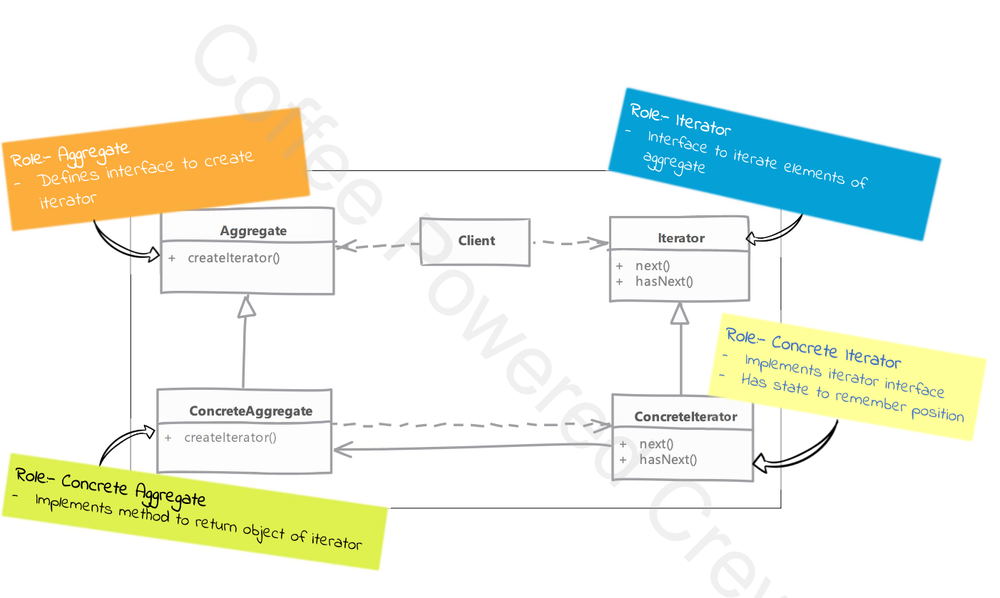

# Iterator

## Type: `Behavioral`

## What is Iterator?

Iterator is a behavioral design pattern that lets you traverse elements of a collection without exposing its underlying representation (list, stack, tree, etc.).

Allows a way to access the elements of an aggregate object sequentially without exposing its underlying representation.

Iterator are stateful, they keep track of the current element and know how to move to the next element.

Iterators can become out of sync if the underlying collection is modified while another iterator is traversing it.

## Key Idea:
* You hide the complexity of the collection.
* You provide a standard way to move through the collection.
* The pattern gives you control over how you access the elements (sequentially, reverse, etc.).

## Where it is used?

- When you need to access the elements of an aggregate object without exposing its underlying representation.
- When you need to traverse a collection of elements in various ways.
- When you need to provide a uniform interface for traversing different aggregate structures (that is, to support polymorphic iteration).

## UML diagram 

## Real world examples in php frameworks or php libraries

* PHP SPL Iterators
* Laravel Collections

## Implementation steps

* we start by defining Iterator interface
  * iterator has method to check whether there is an element available or not & to get the current element.
    * it can have also other methods like next, previous, first, last etc.

* we define concrete iterator class which implements Iterator interface.
    * concrete iterator class has reference to the collection object.
    * it can have a pointer to the current element.

* concrete iterator can maintain state to tell its position in collection of aggregate
  * if the inner collection changes it can throw an exception to indicate invalid state

## Implementation considerations

* detecting change to underlying data structure while some code is using an iterator is important notify to the client because then our iterator may not work correctly.

## Design Considerations

* there a very rare scenarios where you need to implement your own iterator, as php provides built-in Iterator interface.
* always prefer iterator interface so you can change the implementation of iterator without changing the client code.
* always prefer to use SPL iterators as they are well tested and optimized.

## Pitfalls

* access to index during iteration is not readily available.
* making modification to the collection while someone is using iterator often make iterator invalid as its state may not be valid anymore.

---

## PHP specific

In PHP, both IteratorAggregate and the Iterator interface are part of the SPL (Standard PHP Library), and they serve different purposes when implementing the Iterator Design Pattern.

* Iterator Interface:
  * The Iterator interface is used to create custom iterators for traversing a collection. 
  * When you implement this interface, you need to define the following methods to control how the iteration works:
  
  * Methods:
    * current(): Returns the current element.
    * key(): Returns the current key.
    * next(): Moves the pointer to the next element.
    * rewind(): Resets the pointer to the first element.
    * valid(): Checks if the current position is valid.

* IteratorAggregate Interface:
   * The IteratorAggregate interface is simpler and often more convenient to use.
   * It is used when your class already has an internal collection (like an array), and you want to provide an iterator to traverse it.
   * Instead of implementing the individual iterator methods (current(), key(), etc.), you only need to implement one method: getIterator(). This method should return an iterator (like ArrayIterator) that PHP will use to traverse the collection.

* Key Differences:
  * Complexity:
    * Iterator: Requires implementing all the iterator methods (current(), next(), valid(), etc.). This gives you more control over how you traverse the collection. 
    * IteratorAggregate: Only requires the getIterator() method, which returns an iterator object. It is simpler and useful when the internal structure is already iterable (like an array).

* Control:
  * Iterator: Allows custom iteration logic. You might implement special iteration behavior, like skipping items or iterating in reverse order.
  * IteratorAggregate: Is more lightweight and relies on existing iterators, such as ArrayIterator. It’s best when the collection already follows standard iteration patterns.

* Use Case:
  * Use Iterator when you need fine-grained control over the iteration process, such as manipulating how elements are retrieved or iterating in a custom order.
  * Use IteratorAggregate when you just want to expose an iterable structure (like an array or a collection) without having to manually implement iteration logic.

* When Should You Use IteratorAggregate?
  * You should use IteratorAggregate when:
    * You have a collection (like an array) that is already iterable, and you just want to expose it to be traversed by external code. 
    * You don't need to customize how the iteration happens (for example, you don't need to skip certain elements or reorder them). 
    * In practice, IteratorAggregate is more convenient for most scenarios where the internal collection can be iterated directly, whereas Iterator is helpful when you need more complex control over the iteration behavior.

* When Should You Use Iterator?
  * Use Iterator when:
    * You need to customize the way the collection is iterated, such as skipping elements, custom sorting, or iterating in a special order. 
    * You need to implement your own collection structure and control exactly how each item is accessed during iteration.

* In summary:
  * Iterator gives you full control over how iteration works. 
  * IteratorAggregate is a simple and cleaner solution when you already have an iterable structure and don’t need custom iteration logic.

---

## Example

* Iterator using php built-in SPL iterators
* Custom Iterator implementation
