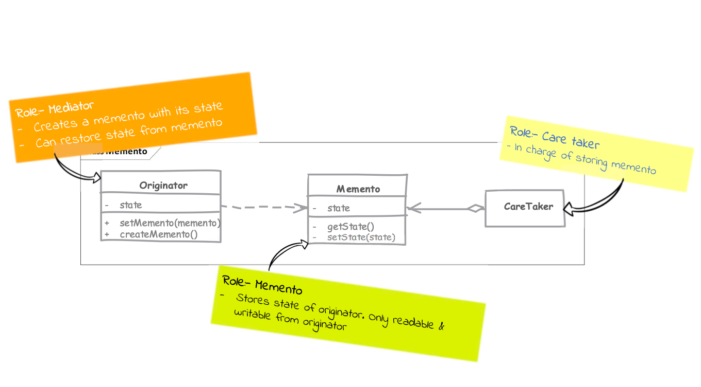

# Memento

## Type: `Behavioral`

## What is Memento?

Memento is a behavioral design pattern that lets you save and restore the previous state of an object without revealing the details of its implementation.

* the main intent behind saving state is often because we want to restore the object to a saved state

* using memento we can ask an object to give its sate as a single, "sealed" object & store it for later use

* this pattern is often combined with Command design pattern to implement undoable operations 

---
This is similar with event sourcing, but the difference is that event sourcing is used to store the history of an object, while memento is used to store the state of an object.

## Where it is used?

* when you want to save the state of an object so that you can restore it later.

## UML diagram 

## Real world examples in php frameworks or php libraries

* Laravel's `Eloquent` model uses `Memento` pattern to save the state of the model before it is updated or deleted.
* `Doctrine` ORM uses `Memento` pattern to save the state of the entity before it is updated or deleted.
* `Symfony` uses `Memento` pattern to save the state of the form before it is submitted.

## Implementation steps

* we start by finding originator state which is to be stored in memento

* we then implement the memento with requirement that it cannot be changed (is immutable) and cannot be read outside the originator
  * this is because the memento is a history of the originator

* originator provides a method to get its current state which will return an instance of memento

* another method in originator takes a memento object as argument and restores the state of originator to the state of memento

## Implementation considerations

* it is important to keep an eye on the size of state stored in memento
  * a solution for discarding older state may be needed to handle large memory consumption

* resetting to previous state should consider effects on states of other objects/services that can be composed or communicate with the originator

## Design Considerations

* we may want to not store the entire history of the originator, but only a few states
  * in this case, we can implement a `Caretaker` class that will store the mementos and provide the undo functionality
    * this is good approach in scenarios where we want to limit the number of states that can be restored
      * and to limit the memory consumption

* mementos can be stored internally by originator as well but this complicates the originator.
  * an external caretaker with fully encapsulated Memento provides you with more flexibility in implementation

## Pitfalls

* in practice creating a snapshot of state may not be easy if other objects are part of the originator's state

* resetting state may not be as simple as copying references
  * if state change of originator is tied with other parts of application then those parts may become out of sync/invalid due to resetting state.

## Compare and contrast with Command

### Memento

* state of memento is sealed for everyone except the originator
* a memento needs to be stored for it to be of any use

### Command

* although commands are typically immutable their state is often readable
* commands can be stored as well but not storing them after execution is optional

---

## Example

### Overview

#### Document Editor (Undo Functionality)

* In an enterprise setting, think about a Document Editor (like a word processor).
* When a user edits a document, they can hit "Undo" to restore it to a previous state.
* This is exactly what the Memento pattern can help with.

#### Components of the Memento pattern:

* Originator: The object whose state you want to save and restore.
  * In our example, the Document class is the Originator.
  
* Memento: A class that stores the state of the Originator and provides it back when needed.
  * In our example, the DocumentMemento class is the Memento.
  
* Caretaker: Manages the mementos (saving and restoring) but doesn't know about the internal workings of the Originator.
  * In our example, the DocumentHistory class is the Caretaker.

#### Steps to Use

* Create the Originator: Instantiate the Document class, which represents the object whose state you want to save and restore.
* Create the Caretaker: Instantiate the History class, which will manage the saved states (mementos).
* Modify the Originator's State: Use the write method of the Document class to change its content.
* Save the State: Use the save method of the Document class to create a memento and then use the save method of the History class to store this memento.
* Restore the State: Use the undo method of the History class to restore the Document to its previous state.

#### Example Scenario
* Initial State: Start with an empty document.
* First Change: Write the first sentence and save the state.
* Second Change: Write the second sentence and save the state.
* Third Change: Write the third sentence without saving the state.
* Undo Changes: Use the undo functionality to revert to previous states step-by-step.

#### Key Points
* The Document class (Originator) is responsible for creating mementos and restoring its state from them.
* The DocumentMemento class (Memento) stores the state of the Document.
* The History class (Caretaker) manages the mementos and provides undo functionality.

This pattern is particularly useful in scenarios where you need to provide undo functionality, such as in text editors, drawing applications, or any other application where state changes need to be reversible.

