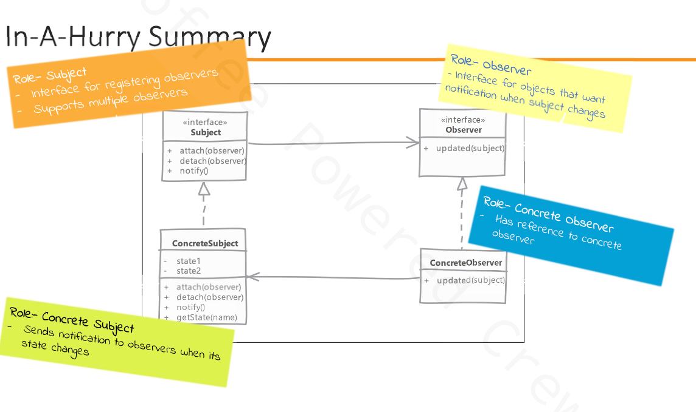

# Observer

## Type: `Behavioral`

## What is Observer?

Observer is a behavioral design pattern that lets you define a subscription mechanism to notify multiple objects about any events that happen to the object they’re observing.

* using observer we can notify multiple objects whenever an object state changes.
* it is also called as publish-subscribe pattern or pub-sub pattern.

* we are defining one to many dependency between objects so that when one object changes state, all its dependents are notified and updated automatically.
  * this is done without coupling the sender of the notification to the receivers.

* it is often implemented where listeners only get notifications that "something" has changed in the object's state
  * listeners usually query back to find out more information if needed
    * this makes it more generic as different listeners may be interested in different states.

## Where it is used?

* when a change to one object requires changing others, and you don't know how many objects need to be changed.
* when an object should be able to notify other objects without making assumptions about whom these objects are.

## UML diagram 

## Real world examples in php frameworks or php libraries

* Symfony Event Dispatcher
* Laravel Events
* Magento Events

## Implementation steps

* we defined an interface for observer
  * is usually a very simple interface and defines a method used by "subject" to notify about state change

* subject (i.e. observable) can be an interface if we are expecting our observers to listen to multiple objects or else subject can be any concrete class

* implementing subject means taking care of handling attach, detach of observer, and notifying all registered observers
  * we also need to provide methods to provide state information when requested by observers

* concrete observers use a reference passed to them t call "subject" for getting more information about the state
  * if we are passing the changed state in notify method then this is not required
    * however, this is not very flexible as we may need more information from the subject in the future

## Implementation considerations

* in some rare scenarios you may end up with circular update loop
  * e.g. observer A updates the state which triggers observer B to update the state which triggers observer A to update the state and so on

* an observer object can listen for changes in multiple subjects
  * it becomes quite easy to identify the originator for the notification if subject is passed by reference in notify method

* performance can become an issue if number of observer are higher and if one or many of them need noticeable time to process notification.

## Design Considerations

* to reduce number of notification sent on each state update, we can also have observers register for a specific event or action
  * this improves efficiency because the subject notify only interested observers instead of all registered observers

* Typically, notifications are send by observable when some changes its state
  * but we can also mate the client code, which is changing subject's state to send notification too
    * however client code get this additional responsibility which they may forget to carry out

## Pitfalls

* every setter method triggering updates may be too much if we have client setting properties one after another on our observable
  * we need to be careful about when to trigger the notification
    * we should trigger notification only a specific state in which we are interested in is changed

* each update become expensive as no. of observers increase, and we have one or more slow observers in the list

* if observers call back the subject to find what changed then this can add up to quite a bit of overhead

## Compare and contrast with Mediator

### Observer

* provides with one-to-many relationship between objects
* communication is simple & can be describer as a publish-subscribe model

### Mediator

* mediators have many objects communicating with many other objects
* communication is complex and can be described as a many-to-many relationship
  * all objects participating can be notified based on different business logic

---

## Example

### Overview

In the provided context, the problem being addressed is the need to manage and react to changes in the state of an Order object.
Specifically, we want to ensure that when certain properties of the Order (such as price, quantity, or shipment status) change, other parts of the system (observers) are notified and can respond accordingly.  

### Problem Overview

* Order State Management:
  * The Order class represents an order with properties like price, quantity, and shipped status.
  * When these properties change, the system needs to perform additional actions, such as updating inventory, recalculating prices, or handling shipment processes.  
* Decoupling State Changes from Reactions:
  * We want to decouple the Order class from the specific actions that need to be taken when its state changes.
  * This allows the Order class to focus solely on managing its state, while other classes (observers) handle the specific reactions to state changes.  
* Notification Mechanism:
  * Implementing a mechanism where the Order class can notify multiple observers about state changes without being tightly coupled to the observers.
  * This is achieved through the Observer design pattern.

### Components
* Subject (Observable): The object that holds the state and sends notifications to observers when the state changes.
  * Order: This is the Subject that maintains a list of observers and notifies them of any state changes.
* Observer: The object that wants to be notified when the state of the subject changes.
  * In our example this is the interface
* ConcreteSubject: A concrete implementation of the Subject.
  * Order: This is the ConcreteSubject that maintains a list of observers and notifies them of any state changes.
* ConcreteObserver: A concrete implementation of the Observer
  * QuantityObserver, PriceObserver, InventoryObserver: Concrete implementations of the AbstractObserver that react to specific changes in the Order.

### Usage
* Initialization: Create an instance of the Order class (Subject).
* Attaching Observers: Attach instances of QuantityObserver, PriceObserver, and InventoryObserver to the Order instance.
* State Change: Change the state of the Order (e.g., change price, change quantity, ship order).
* Notification: The Order instance notifies all attached observers about the state change.
