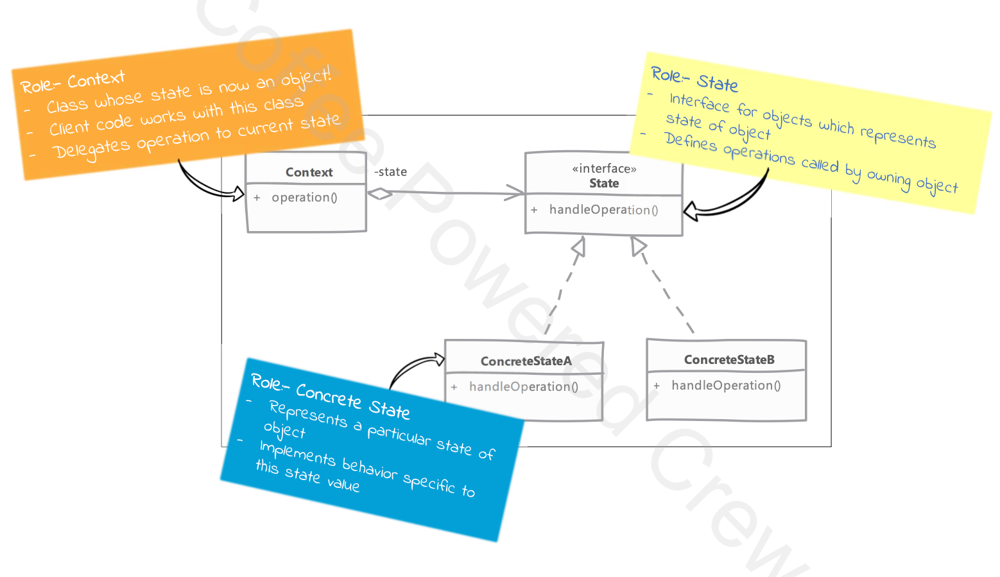

# State 

## Type: `Behavioral`

## What is State?

* The State design pattern allows an object to change its behavior when its internal state changes.
* It’s like having different modes or conditions, and the object reacts differently depending on its current mode.
* You delegate the behavior to different state objects instead of having multiple conditions inside a single class.

* state transitions can be triggered by states themselves in which case each state knows about at least one other state's existence

* a benefit of this pattern is that new states and thus new behaviours can be added without changing our main class

## Key Concept:
* Instead of using a lot of if or switch statements to handle different states, you separate each state into its own class.
* This makes the code more maintainable and flexible.

## Key Components:

* **Context**: The object that has a state. It delegates the behavior to the state object.
* **State**: An interface or abstract class that defines the behavior for each state.
* **Concrete State**: The implementation of the state interface. Each concrete state has its own behavior.
* **Client**: The object that uses the context and state objects.

## Where it is used?

* When an object’s behavior depends on its state and it must change its behavior at runtime depending on that state.
* When you have a lot of conditional statements that depend on the object’s state.
* When you have a class that changes its behavior based on its internal state.

## UML diagram 

## Real world examples in php frameworks or php libraries

* Laravel's `Illuminate\Database\Eloquent\Model` class uses the state pattern to manage the state of the model (e.g., new, saved, deleted, etc.).
* Symfony's `HttpKernel` class uses the state pattern to manage the state of the application (e.g., handling requests, responses, etc.).
* Doctrine's `EntityManager` class uses the state pattern to manage the state of the entity manager (e.g., open, closed, etc.).

## Implementation steps

* identify distinct values for state of our object (context)
  * each state value will be a separate class in our implementation
  * these classes will provide behaviour specific to the state value they represent

* in our main/context class method implementations, we will delegate the behaviour to the current state object
  * our client will not directly the state object
    * they will only interact with the main/context object

* we have to decide how our state transition if going to happen
  * states can themselves transition to next state based on input received in a method
  * other options is that context itself can initiate the state transition
  * we can also have a state manager class that will manage the state transitions

* clients interacts with only the context object, and it's unaware of the existence of state objects

## Implementation considerations

* in some implementation clients themselves can configure context with initial state
  * however after that initial configuration, clients should not be able to change the state of the context object

* if state transitions are done by state object itself then it has to know about at least one state
  * this adds to the amount of code needed when adding new states

## Design Considerations

* using flyweight pattern we can share states which do not have any instance variables and only encapsulate behaviour specific to the state

## Pitfalls

* a lot more classes are created for providing functionality of context 
 
* state transitions can be complex to manage and implement
  * this becomes more complicated if there are multiple possible state to which object can transition from current state
  * and if states are responsible for transitioning to next state then we have a lot more coupling between states

* we may not realize all possible states we need at the beginning of our design
  * as our design evolves we may need to add more states to handle a particular behaviour

## Compare and contrast with Command

### State

* implements actual behaviour of an object specific to a particular state

* a state object represent current state of our context

### Command

* simply call a specific operation on receiver
* command represent an operation or request without any direct relation to the state of the receiver

---

# Example - TM Machine State Pattern Example

## Overview

This project demonstrates the implementation of the **State Design Pattern** using an **ATM Machine** as the primary example. The ATM operates through multiple states such as `Idle`, `CardInserted`, `PinEntered`, `TransactionSelected`, and `CashDispensed`. The behavior of the ATM changes based on its current state, and the **State Pattern** helps to encapsulate each state's behavior separately, avoiding the need for complex conditionals.

### Problem Solved

Traditional implementations of systems like an ATM often rely on conditional logic to handle different phases (states) of a process. For example, a long sequence of `if-else` or `switch` statements can be used to manage transitions between different states such as inserting a card, entering a PIN, selecting a transaction, and dispensing cash.

This approach becomes difficult to maintain as new features or business rules are introduced. The **State Design Pattern** resolves this issue by encapsulating each state's behavior into its own class. It enables the system to transition smoothly between states while keeping the codebase clean, maintainable, and scalable.

## Components

The ATM Machine example is broken down into several key components:

### 1. ATM Context

- The **ATM** class acts as the central controller, holding a reference to the current state and delegating operations (like inserting a card, entering a PIN, etc.) to the current state's logic.
- This class is responsible for state transitions but doesn't implement the specific logic for each state. Instead, it calls methods on the state object, allowing the system to behave differently depending on the state.

### 2. ATM State Interface

- The **ATMState** interface defines the actions that can be performed at any stage of the transaction process. These actions include:
  - `insertCard()`
  - `enterPin()`
  - `selectTransaction()`
  - `dispenseCash()`
  - `ejectCard()`
- Every state implements this interface and provides specific behavior for each of these actions based on the current state.

### 3. Concrete State Classes

Each concrete state class represents a specific stage of the ATM machine’s transaction process. Each state only handles the behavior pertinent to that state:

- **IdleState**:  
  The ATM is waiting for a card to be inserted.

- **CardInsertedState**:  
  The ATM has a card inserted and is now waiting for the user to enter their PIN.

- **PinEnteredState**:  
  The ATM accepts the PIN and waits for the user to select a transaction.

- **TransactionSelectedState**:  
  The ATM processes the selected transaction, ready to dispense cash.

- **CashDispensedState**:  
  The ATM dispenses the cash and prepares to eject the card.

### 4. State Transitions

Transitions between states are managed internally within the ATM Context. After each operation is completed, the context moves to the next state:

- From **IdleState** to **CardInsertedState** after inserting a card.
- From **CardInsertedState** to **PinEnteredState** after entering a correct PIN.
- From **PinEnteredState** to **TransactionSelectedState** after selecting a transaction.
- From **TransactionSelectedState** to **CashDispensedState** after dispensing cash.
- Finally, the ATM returns to **IdleState** after the card is ejected.

## Usage

By creating an instance of the ATM class and interacting with it, users can perform actions such as inserting a card, entering their PIN, selecting transactions, and retrieving cash. The State Pattern ensures that the ATM's behavior changes seamlessly according to the current state, without complex conditional logic.

For example:
- Initially, the ATM is in **IdleState**, waiting for a card to be inserted.
- After inserting a card, the ATM moves to **CardInsertedState**.
- After entering the correct PIN, it transitions to **PinEnteredState**.
- The user can then select a transaction, moving the system to **TransactionSelectedState**.
- Once the cash is dispensed, the ATM enters **CashDispensedState** and awaits the card ejection.

## Conclusion

The **State Design Pattern** offers a clean and flexible solution for managing state transitions in systems that have multiple, clearly defined states, such as an ATM machine. By encapsulating the behavior for each state in separate classes, the pattern promotes maintainability, readability, and scalability. Instead of relying on complex conditionals, the ATM delegates its behavior to state objects, allowing each state to handle only the logic relevant to it.

In enterprise applications, the **State Pattern** is commonly used in systems with distinct phases such as:
- Document approval workflows
- Order processing systems
- Network connection management
- Traffic light control systems

The **State Design Pattern** allows developers to create robust, flexible systems that are easy to extend and maintain as the application grows or requirements evolve.

