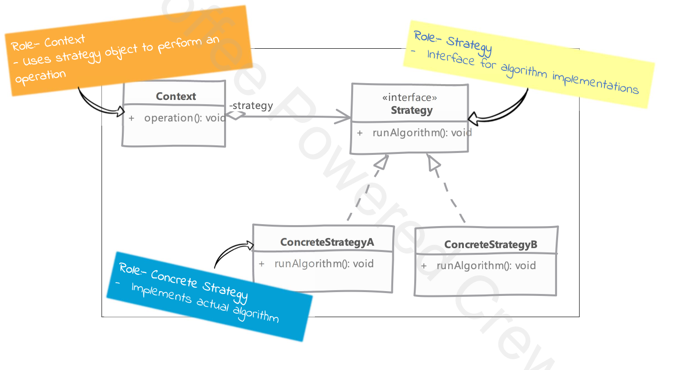

# Strategy 

## Type: `Behavioral`

## What is Strategy?

Strategy is a behavioral design pattern that lets you define a family of algorithms, put each of them into a separate class, and make their objects interchangeable.

* a good indication for applicability of strategy pattern is if we find different algorithms in our method which are selected using conditional statements.

* strategy classes are usually implemented in an inheritance hierarchy, so we can choose the strategy at runtime.

## Key Components:

* **Context**: maintains a reference to the strategy object. It also defines an interface that lets the strategy object access its data.
* **Strategy**: declares an interface common to all supported algorithms. Context uses this interface to call the algorithm defined by a ConcreteStrategy.
* **ConcreteStrategy**: implements the algorithm using the Strategy interface.
* **Client**: creates a specific strategy object and passes it to the context. The context exposes a setter which lets clients replace the strategy associated with the context at runtime.

## Where it is used?

* When you need to use different variants of an algorithm within an object and be able to switch from one algorithm to another during runtime.
* When you have a class that has a lot of conditional statements that select one of the same algorithms among many.
* When you have a class that has a lot of conditional statements that select one of the several behaviors that depend on the state of the object.

## UML diagram 

## Real world examples in php frameworks or php libraries

* Laravel's `Mail` class uses the strategy pattern to send emails. The `Mail` class has a `send` method that accepts an instance of the `Mailer` interface. The `Mailer` interface has a `send` method that is implemented by the `SmtpMailer` and `SendmailMailer` classes. The `Mail` class can send emails using either the `SmtpMailer` or `SendmailMailer` class.
* Symfony's `Form` component uses the strategy pattern to render forms. The `Form` class has a `render` method that accepts an instance of the `FormRenderer` interface. The `FormRenderer` interface has a `render` method that is implemented by the `TwigRenderer` and `PhpRenderer` classes. The `Form` class can render forms using either the `TwigRenderer` or `PhpRenderer` class.
* Doctrine's `EntityManager` class uses the strategy pattern to persist entities. The `EntityManager` class has a `persist` method that accepts an instance of the `EntityPersister` interface. The `EntityPersister` interface has a `persist` method that is implemented by the `SqlPersister` and `MongoPersister` classes. The `EntityManager` class can persist entities using either the `SqlPersister` or `MongoPersister` class.

## Implementation steps

* we start by defining the strategy interface that declares a method for the algorithm.
  * this will be consumed by the context class that uses the strategy.

* we provide concrete implementations of the strategy interface.
  * we implement a concrete strategy for each algorithm.

* our context class provides a way to set the strategy object.
  * the context class has a reference to the strategy object and uses it to execute the algorithm.
  * clients can set the strategy object at runtime.
  * the context class can also change the strategy object at runtime depending on specific conditions (e.g. user input, system state, etc).

## Implementation considerations

* we can implement our context in a way where strategy object is optional
  * this makes context usable for client code who do not want to deal with concrete strategies.
  * we can use also a default strategy object in the context class.
  
* strategy object should be given all data they need as arguments to its method
  * if a number of arguments are high then we cna pass strategy an interface reference which it queries for data
    * context object can implement this interface and pass itself to strategy

* strategies typically end up being stateless objects making them perfect candidates for sharing between context objects.

## Design Considerations

* strategy implementations can make use of inheritance to factor out common parts of algorithms in base classes making child implementations simpler.

## Pitfalls

* since client code configures context object with appropriate strategy object, clients know about all implementation of strategy.

## Compare and contrast with State

### Strategy

* we create a class per algorithm
* strategy objects do not need to know about each other

### State

* we create a class per state
* if states are responsible for state transitions then they need to know about each other

---

# Example

### Problem Overview

* In our specific example, we are dealing with the problem of sending messages using different transport mechanisms.
* The challenge is to design a system that allows us to switch between different transport strategies (e.g., HTTP, HTTPS, SFTP) without modifying the core logic of the message-sending process.
* This is a classic scenario where the Strategy design pattern is highly applicable.  

### Key Components in Our Example

* Context (Transport):
  * Maintains a reference to a strategy object.
  * Defines an interface to interact with the strategy object.
  * Delegates the task of sending messages to the strategy object.

* Strategy (TransportStrategyInterface):  
  * Declares an interface common to all supported transport algorithms.
  * The Transport class uses this interface to call the transport method.

* ConcreteStrategy (HttpsTransportStrategy, HttpTransportStrategy, SftpTransportStrategy):  
  * Implements the transport algorithm using the TransportStrategyInterface.
  * Each concrete strategy provides a different way to send messages.

* Client (use-strategy.php):  
  * Creates a specific strategy object and passes it to the Transport context.
  * The client can replace the strategy associated with the Transport context at runtime.

### Problem Solution

By using the Strategy design pattern, we achieve the following:  

* Flexibility: We can easily switch between different transport mechanisms without changing the core logic of the Transport class.
* Maintainability: Each transport mechanism is encapsulated in its own class, making the code easier to maintain and extend.
* Scalability: Adding new transport mechanisms involves creating new strategy classes without modifying existing code.

* This approach ensures that our system is open for extension but closed for modification, adhering to the Open/Closed Principle of SOLID design principles.

