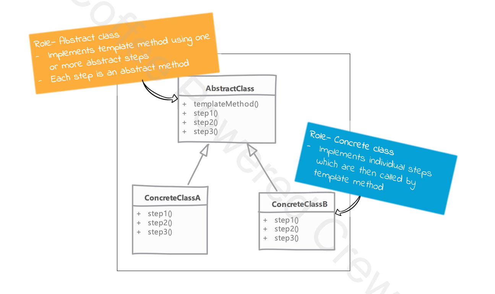

# Template Method 

## Type: `Behavioral`

## What is Template Method?

Template Method is a behavioral design pattern that defines the skeleton of an algorithm in the superclass but lets subclasses override specific steps of the algorithm without changing its structure.

* using template method we defined al algorithm in a method as a series of steps (method calls) and provide a chance for subclasses to define or redefine some of these steps.

* words by defining abstract methods which then have to be implemented by the subclasses.
  * these methods are like hooks which are then called by template method

* it allows you to defer implementation or parts of your algorithm which can vary or change

* template methods are an example of inversion of control principle - Do not call us, we will call you
  * this is of course reffering to the way template method calls other methods implemented by subclasses

## Key Components:

1. Abstract Class: 
    * It defines the template method that contains a series of steps.
    * It also contains the abstract methods that are used in the template method.
    * It can also contain the concrete methods that are used in the template method.
2. Concrete Class:
    * It implements the abstract methods defined in the abstract class.
    * It can also override the concrete methods defined in the abstract class.
    * It can also define additional methods that are not defined in the abstract class.

Concepts: 
* Template Method:
    * It is a method that contains a series of steps.
    * It calls the abstract methods defined in the abstract class.
    * It can also call the concrete methods defined in the abstract class.
    * It can also call the additional methods defined in the concrete class.
* Abstract Method:
    * It is a method that is declared in the abstract class but not defined.
    * It is implemented by the concrete class.
* Concrete Method:
    * It is a method that is defined in the abstract class.
    * It can be overridden by the concrete class.
    * It can be called by the template method.

## Where it is used?

* when you want to let clients extend only particular steps of an algorithm, but not the whole algorithm or its structure.

## UML diagram 

## Real world examples in php frameworks or php libraries

* Laravel: 
    * Laravel uses the Template Method pattern in the `Illuminate\Database\Eloquent\Model` class. 
    * The `Model` class contains the `save` method, which is a template method that contains a series of steps.
    * The `save` method calls the `performInsert` and `performUpdate` methods, which are abstract methods that are implemented by the `Model` class.
    * The `save` method also calls the `fireModelEvent` method, which is a concrete method that is defined in the `Model` class.
    * The `save` method also calls the `touchOwners` method, which is a concrete method that is defined in the `Model` class.
    * The `save` method also calls the `finishSave` method, which is a concrete method that is defined in the `Model` class.

  
## Implementation steps

* we start by defining our algorithm in template method
  * we try to break the algorithm in multiple steps where each step will become an abstract method

* while breaking down algorithm the number of steps should not be too many, or it can become quite tedious to implement all of them in subclasses

* next we implement the abstract steps in one or more subclasses

## Implementation considerations

* a balance must be kept in how much granular we want to keep our steps
  * too many steps means too many methods to override for subclass where each one may be just a primitive operation
  * too few steps means we are not really providing much flexibility to subclasses

* if needed the template method can be made final to prevent subclasses from changing the base algorithm structure

## Design Considerations

* we can use inheritance within subclasses to reuse parts from already implemented steps
  * this approach allow subclasses to only change steps they need

* factory method design pattern uses template method.
  * actual factory method is often called as part of another template method.

## Pitfalls

* tracking down what code executed as part of our algorithm requires looking up multiple classes.
  * the problem become more apparent if subclasses themselves start using inheritance to implement to reuse only some of the existing steps & customizing others

* unit testing can become a little more difficult as the individual steps may require some specific state values to be present

## Compare and contrast with Strategy

### Template Method

* all subclasses implement steps for the exact same algorithm
* client relies solely on inheritance to get a variation of the same algorithm

### Strategy

* each subclasses represent a different algorithm
* client code uses composition principle to switch between different algorithms

---

# Example

### Problem Overview

* In this example, the problem of generating different types of reports (HTML and CSV) is solved using the Template Method pattern.
* The invariant part of the report generation process is defined in an abstract class, while the specific steps for gathering data, formatting data, and exporting the report are implemented in subclasses.

### Components Used

* AbstractReport (Abstract Class)  
  * Defines the template method generateReport() which outlines the steps for generating a report.
* Declares abstract methods gatherReportData(), formatReportData(array $data), and exportReport() that must be implemented by subclasses.
* HtmlReport (Concrete Class)  
  * Extends AbstractReport.
  * Implements the gatherReportData() method to gather data for the report.
  * Implements the formatReportData(array $data) method to format the data as HTML.
  * Implements the exportReport() method to export the report as an HTML file.
* CsvReport (Concrete Class)  
  * Extends AbstractReport.
  * Implements the gatherReportData() method to gather data for the report.
  * Implements the formatReportData(array $data) method to format the data as CSV.
  * Implements the exportReport() method to export the report as a CSV file.

* use-template-method.php (Client Code)  
  * Demonstrates the usage of the Template Method pattern by creating instances of HtmlReport and CsvReport and calling their generateReport() methods.

### Conclusion
This example showcases how the Template Method pattern can be used to create a flexible and reusable framework for generating different types of reports while keeping the core algorithm structure intact.
