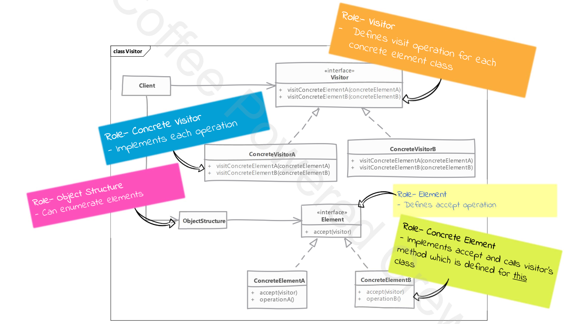

# Visitor 

## Type: `Behavioral`

## What is Visitor?

* The Visitor design pattern allows you to separate algorithms from the objects on which they operate.
* This pattern is useful when you need to perform operations on a set of objects that belong to different classes, but you don't want to modify the classes themselves every time you need to add a new operation.

## Simple Explanation:

* You have objects of different types (let's say User, Order, and Invoice).
* Instead of adding methods to these classes for every new operation (like printing details, exporting to CSV, etc.), you define these operations separately in a Visitor.
* The objects (User, Order, Invoice) will accept a visitor, and the visitor will perform the specific operation on them.

## Key Components:

* Visitor Interface: Defines a method for each class you want the visitor to operate on.
* Concrete Visitor: Implements the visitor interface to define specific operations.
* Element Interface: Defines the accept method that takes a visitor.
* Concrete Elements: Implement the accept method to allow the visitor to perform the operation.

---

* each time we need a new operation we create a subclass of visitor, implement the operation in that class and visit the object structure
* objects themselves only implement an "accept" visit where the visitor is pass as an argument.
  * object know about method in visitor created specifically for it and invoke that method inside the accept method

## Where it is used?

* When you have a set of objects of different classes and you want to perform operations on them without modifying the classes.
* When you want to add new operations to existing objects without changing their structure.

## UML diagram 

## Real world examples in php frameworks or php libraries

* Doctrine ORM: Doctrine is a popular Object-Relational Mapping (ORM) library for PHP. While it doesn't explicitly implement the Visitor pattern, you can see concepts similar to it in the way it handles queries and entities. The Visitor pattern can be applied when extending queries or applying transformations to different types of entities without modifying their core structure.
* 
  
## Implementation steps

* we create visitor interface by defining "visit" methods for each class we want to support

* the classes who want functionalities provided by visitor define "accept" method which accepts a visitor
  * these methods are defined using the visitor interface as parameter type so that we can pass any class implementing the visitor interface
  * in the accept method we'll call a method on visitor that is defined specifically for the class

* we create concrete visitor classes that implement the visitor interface and define the operations

## Implementation considerations

* visitor can work with object of classes which do not have a common parent

* often visitors need access to internal state of objects to carry out their work
  * so we may have to expose the state using getter/setter methods

## Design Considerations

* one effect of this pattern is that related functionality is grouped in a single visitor class instead of spread across multiple classes
  * this can make the code easier to maintain and understand
  * so adding new functionality is as simple as adding a new visitor class

* visitors can also accumulate state as they visit objects
  * so along with behaviour we can also have state per object in our visitor
  * we don't have to add new state to objects for behaviour defined in visitor
    * this is very useful as we will not have to modify the object classes each time we need a new operation

## Pitfalls

* often visitors need access to object's state
  * so we end up exposing a lot of state through getter methods, weaker encapsulation

* supporting a new class in our visitors requires changes to all visitor implementations

* if the classes themselves change then all visitors have to change as well since they have to work with changed class.

* a little bit confusing to understand and implement at first

## Compare and contrast with Strategy pattern

### Visitor

* all visitor subclasses provide possibly different functionalities from each other.

### Strategy

* each strategy subclasses represents separate algorithm to solve the exact same problem.

---

### Reasons It Can Be Perceived as Difficult:

* Double Dispatch: The pattern involves double dispatch, where the type of both the visitor and the element (e.g., Shipment) need to be identified at runtime to determine the correct method to execute. This can be confusing, especially for those who are not familiar with this concept.
* Separation of Concerns: The Visitor pattern enforces the separation of operations (e.g., auditing, reporting) from the objects on which they operate. Some developers may find it unintuitive to move behavior out of the objects themselves and into a separate "visitor" class.
* Extensibility Trade-offs: While the Visitor pattern makes it easy to add new operations (visitors), it becomes more difficult to add new element types (e.g., new shipment types), as all existing visitors would need to be updated to handle them. This can lead to complexity when maintaining large systems.
* Verbosity: It can feel verbose and repetitive, especially when dealing with multiple types of elements and operations. This might make it seem harder or more cumbersome than other patterns.

### Reasons It May Not Be That Difficult:

* Predictable Structure: Once understood, the Visitor pattern follows a predictable and systematic structure: each element (e.g., shipment) has an accept method, and each visitor implements methods for handling different element types.
* Clear Separation: The pattern actually helps in keeping the code organized by separating behaviors (like auditing, notifications, etc.) from the object’s core data. This can simplify logic, making it more manageable over time.
* Common in Business Logic: In PHP applications that involve complex business logic, like logistics, finance, or auditing, the Visitor pattern is very useful. It helps avoid bloating entity classes with multiple unrelated operations.

### Difficulty Level:

* For Intermediate Developers: It may feel a bit advanced due to the abstractness of the pattern and the concept of double dispatch. However, after understanding how the pattern works, it becomes easier to apply in the right scenarios.
* For Advanced Developers: Once you are comfortable with design patterns and object-oriented principles, the Visitor pattern is easier to grasp and implement effectively.

---

# Example

### Problem Overview

* In this example, the problem of auditing and calculating insurance costs for different types of shipments (Standard, Express, and International) is solved using the Visitor pattern.
* The Visitor pattern allows adding new operations to existing object structures without modifying the structures themselves.

### Components Used

#### Interfaces

* ShipmentVisitorInterface  
  * Defines the interface for visitor classes.
  * Declares visit methods for each type of shipment (e.g., visitStandardShipment, visitExpressShipment, visitInternationalShipment).

* ShipmentInterface  
  * Defines the interface for shipment classes.
  * Declares the accept method that takes a visitor as an argument.

#### Concrete Visitors

* ShipmentAuditVisitor  
  * Implements the ShipmentVisitorInterface.
  * Contains logic to audit different types of shipments.
  * Implements visit methods for each type of shipment.

* ShipmentInsuranceVisitor  
  * Implements the ShipmentVisitorInterface.
  * Contains logic to calculate insurance costs for different types of shipments.
  * Implements visit methods for each type of shipment.

#### Concrete Shipments
* StandardShipment - represents a standard shipment.
  * Contains properties and methods specific to standard shipments.
  * Implements the accept method to accept a visitor.

* ExpressShipment - represents an express shipment.
  * Contains properties and methods specific to express shipments.
  * Implements the accept method to accept a visitor.

* InternationalShipment - represents an international shipment.
  * Contains properties and methods specific to international shipments.
  * Implements the accept method to accept a visitor.

#### Client Code
  * Demonstrates the usage of the Visitor pattern by creating instances of ShipmentAuditVisitor and ShipmentInsuranceVisitor.
  * Creates instances of StandardShipment, ExpressShipment, and InternationalShipment.
  * Uses the visitors to audit the shipments and calculate their insurance costs.

#### Conclusion
* This example showcases how the Visitor pattern can be used to add new operations (auditing and calculating insurance costs) to different types of shipments without modifying the shipment classes themselves.
* This approach promotes the open/closed principle by allowing new functionality to be added through visitors.
