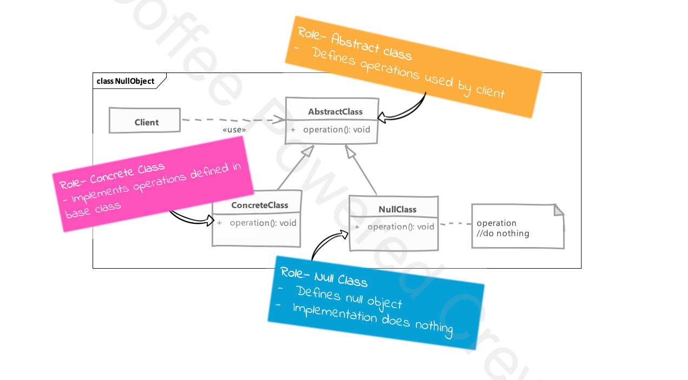

# Null Object Design Pattern

## Type: `Behavioral`

## What is Null Object Design Pattern

The Null Object Design Pattern is a behavioral design pattern that provides an object as a surrogate for the lack of an object of a given type.

* The Null Object Pattern provides intelligent do nothing behavior, hiding the details from its collaborators.
* The Null Object Pattern is used to provide a default behavior in case data is not available.

* we use this pattern when we want to treat absence of a collaborator transparently without null checks.

## Where it is used?

* When we want to provide a default behavior in case data is not available.

## UML diagram 

## Real world examples in php frameworks or php libraries

* Symfony: `Symfony\Component\HttpKernel\Profiler\Profiler`
* Laravel: `Illuminate\Database\Eloquent\Collection`
* Doctrine: `Doctrine\Common\Collections\Collection`

  
## Implementation steps

* we create a new clas that represent our null object by extending from base class or implementing given interface. 

* in the object implementation, for each method we'll not do anything
  * however doing nothing can mean different things in different implementations
    * e.g. if a method in a null object returns something then we can either return another null object, a predefined value or null

* code which create objects of our implementation will create & pass our null object in a specific situation.

## Implementation considerations

* class which is using null object should not have to do anything special when working with this object.
  * it should be able to call methods on the object without checking if it is null or not.

* what "do nothing" means for an operation can be different in different classes
  * this is especially true where methods in null objects are expected to return values

## Design Considerations

* since null objects don't have a state * no complex behaviour they are good candidates for singleton pattern
  * we can use a single instance of null object everywhere

* null objects are useful in many other design patterns
  * in state - to represent a state that does nothing
  * in strategy - to provide a default strategy that does nothing

## Pitfalls

* creating a proper null object many not be possible for all classes.
  * some classes may be expected to cause a change, and absence of that change may cause other class operations to fail.

* finding what "do nothing" means may not be easy or possible
  * if our null object method is expected to return another object then this problem is more apparent.

## Compare and contrast with Proxy

### Null Object

* null objects never transform/create or provide a real object

* null objects do not "act on behalf of" a real object
  * its job is to do nothing

### Proxy

* many types of proxies will ned a real object eventually

* in absence of real object, proxy can provide a default behavior matching the real object

---

# Example

### Problem Overview

* In the given example, the Null Object pattern is used to handle storage operations.
* The problem addressed is the need to save reports to a storage system, but in some cases, such as during unit testing, we do not want to actually perform the save operation.
* By using a null object, we can avoid conditional checks for null and ensure that the code behaves consistently regardless of whether the storage operation is a no-op or a real save.  

### Components

* StorageInterface - An interface that defines the contract for storage operations.
* FileSystemStorage -A concrete implementation of StorageInterface.
  * Simulates saving content to a file system by printing a message.
* NullStorage - A concrete implementation of StorageInterface that does nothing.
  * Useful for scenarios where actual storage is not needed, such as unit testing.

* ReportGenerator - A class that generates reports and saves them using a StorageInterface implementation.
  * Uses dependency injection to accept any implementation of StorageInterface.

* use-null-object.php  
  * A script that demonstrates the usage of the Null Object pattern.
  * Shows how to switch between FileSystemStorage and NullStorage for different scenarios.

### Summary
  * The example demonstrates how the Null Object pattern can be used to simplify code and make it more robust by eliminating the need for null checks.
  * It provides a consistent interface for storage operations, whether the storage is real or a no-op, making the code easier to maintain and test.

